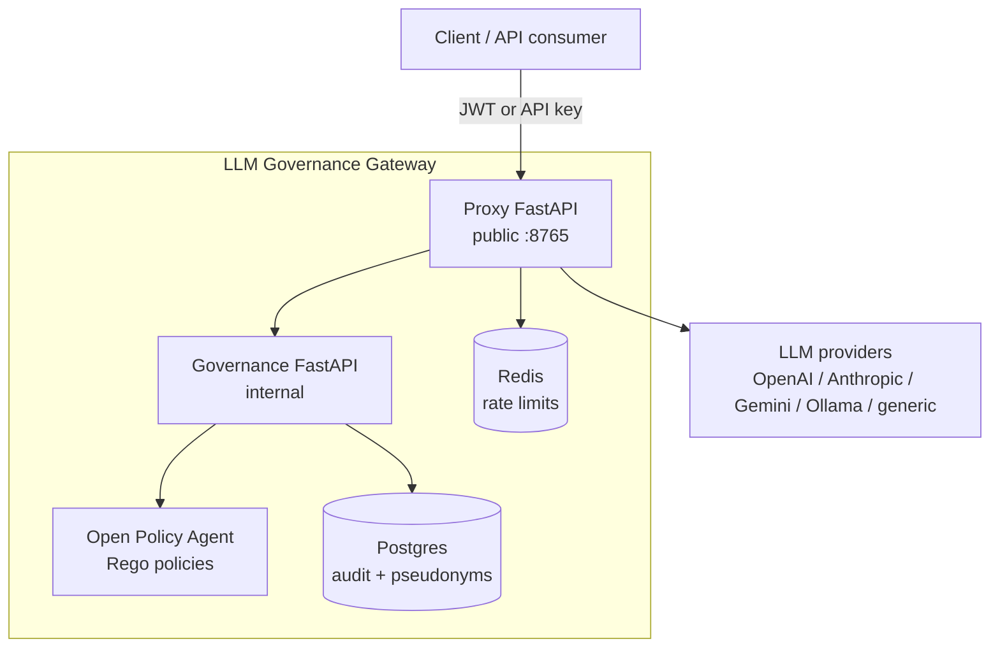

# LLM Governance Gateway

Production-grade OpenAI-compatible LLM gateway with policy enforcement, PII redaction, tenant-aware routing, rate limiting, and append-only audit logging.

## What it does

- Exposes an OpenAI-compatible `POST /v1/chat/completions` API.
- Routes requests across OpenAI, Anthropic, Google Gemini, Ollama, mock providers, and generic OpenAI-compatible backends.
- Authenticates callers with JWTs or provisioned API keys.
- Enforces per-tenant model access, tier-based RBAC, and provider override rules.
- Runs PII detection and pseudonymization before provider dispatch.
- Blocks PHI routing to non-approved providers by default.
- Blocks prompt-injection and banned-topic style harm signals before provider dispatch.
- Applies Redis-backed sliding-window rate limits per tenant/user.
- Writes append-only audit records to Postgres with tenant isolation via Row-Level Security.
- Runs local demos without real provider keys using `MOCK_PROVIDERS=true`.

## Repository layout

```text
.
├── proxy/                 # Public FastAPI gateway, auth, routing, adapters, rate limiting
├── governance/            # Internal FastAPI governance service, PII/harm/policy/audit pipeline
├── policies/llm/          # OPA Rego policies and policy tests
├── policies/data/         # Generated OPA data documents
├── config/                # Seed tenants, users, and model routing config
├── scripts/               # Provisioning, demos, partition rotation, Fly helpers
├── tests/integration/     # Docker Compose smoke tests
├── docs/                  # Architecture, demo scenarios, release notes, plans
├── infra/example/fly.io/  # Optional Fly.io deployment examples
├── docker-compose.yml     # Local stack: proxy, governance, OPA, Postgres, Redis
└── Makefile               # Main operator interface
```

## Architecture



Request path:

1. Client calls the proxy with an OpenAI-compatible chat-completions request.
2. Proxy authenticates the caller and resolves tenant/user context.
3. Proxy checks the Redis sliding-window rate limit.
4. Proxy asks governance to inspect the request text.
5. Governance detects PII, pseudonymizes sensitive values, scores harm, and asks OPA for policy decisions.
6. Governance writes an audit record and returns allow/block/redacted-text metadata.
7. Proxy blocks the request or dispatches the redacted request to the selected provider.
8. Proxy returns the provider response with audit and rate-limit headers.

See [Architecture](docs/architecture.md) for the deeper architecture notes.

## Quickstart

Prerequisites:

- Docker + Docker Compose v2
- Python 3.11+
- `uv`
- `make`
- Optional: `direnv`

Clone:

```bash
git clone https://github.com/<owner>/llm-governance-gateway.git
cd llm-governance-gateway
```

Configure local environment:

```bash
cp .envrc.example .envrc
# edit .envrc if you want real provider calls; mock mode works without provider keys
direnv allow
```

If you do not use `direnv`, export the variables in `.envrc.example` manually.

Generate local secrets:

```bash
export JWT_SECRET=$(python3 -c 'import secrets; print(secrets.token_hex(32))')
export GOVERNANCE_INTERNAL_TOKEN=$(python3 -c 'import secrets; print(secrets.token_hex(32))')
export GATEWAY_BOOTSTRAP_TOKEN=$(python3 -c 'import secrets; print(secrets.token_hex(32))')
export PSEUDONYM_HMAC_KEY=$(python3 -c 'import secrets; print(secrets.token_hex(32))')
export MOCK_PROVIDERS=true
```

Start the stack:

```bash
make up
make status
```

Run the seeded demo:

```bash
make demo
```

The demo starts the stack in mock-provider mode, provisions tenants/users/models, and runs six governance scenarios:

1. clean request allowed
2. PII redacted and allowed
3. PHI blocked for non-approved provider
4. prompt injection blocked
5. tier-2 model denied for tier-1 caller
6. rate limit exceeded

See [Demo scenarios](docs/demo-scenarios.md) for request/response examples and expected audit behavior.

For operator rollout steps, see [Onboarding users and routing agents through the gateway](docs/onboarding.md).

## Basic API usage

Health check:

```bash
curl http://localhost:8765/health
```

Chat completions:

```bash
TOKEN="replace-with-jwt-or-api-key"
curl -X POST http://localhost:8765/v1/chat/completions \
  -H "Authorization: Bearer $TOKEN" \
  -H "Content-Type: application/json" \
  -d '{
    "model": "gpt-4o-mini",
    "messages": [{"role": "user", "content": "Hello"}]
  }'
```

Useful response headers:

- `X-Audit-ID` — audit record correlation ID when governance is reached.
- `X-Gateway-Pii-Redacted` — present when PII was redacted and the tenant config asks for notification.
- `X-Gateway-Pii-Types` — comma-separated PII entity types found.
- `x-ratelimit-limit-requests` — configured request limit for the window.
- `x-ratelimit-remaining-requests` — remaining requests in the current window.
- `x-ratelimit-reset-requests` — rate-limit reset timestamp.

## Make targets

| Target | Description |
|---|---|
| `make up` | Start the Docker Compose stack and wait for health checks |
| `make down` | Stop the stack |
| `make restart` | Restart all services |
| `make status` | Show container health/status |
| `make logs` | Follow service logs |
| `make migrate` | Run governance Alembic migrations |
| `make provision` | Seed tenants, users, models, and OPA data documents |
| `make demo` | Run the local six-scenario governance demo |
| `make test` | Run proxy and governance unit tests |
| `make test-integration` | Run Docker Compose smoke tests |
| `make opa-test` | Run OPA Rego policy tests |
| `make lint` | Run ruff and ty |
| `make rotate-partitions` | Rotate audit partitions |

## Configuration

Seed config lives in:

- `config/models.yaml` — model IDs, providers, base URLs, aliases.
- `config/tenants.yaml` — allowed models, rate limits, PII behavior, default provider.
- `config/users.yaml` — demo users and roles.

Important environment variables:

| Variable | Purpose |
|---|---|
| `JWT_SECRET` | Signs and verifies JWT callers |
| `GOVERNANCE_INTERNAL_TOKEN` | Shared internal token between proxy and governance |
| `GATEWAY_BOOTSTRAP_TOKEN` | Optional bootstrap/admin token |
| `PSEUDONYM_HMAC_KEY` | Key for deterministic PII pseudonymization |
| `DATABASE_URL` | Postgres connection string |
| `REDIS_URL` | Redis connection string |
| `OPA_URL` | OPA server URL used by governance |
| `MODELS_YAML` | Model routing config path |
| `MOCK_PROVIDERS` | Use local mock provider responses instead of external provider calls |
| `OPENAI_API_KEY` | OpenAI provider key |
| `ANTHROPIC_API_KEY` | Anthropic provider key |
| `GEMINI_API_KEY` | Google Gemini provider key |
| `OLLAMA_BASE_URL` | Ollama/OpenAI-compatible local base URL |
| `SPACY_MODEL` | spaCy model used by Presidio PII detection |

Never commit real `.envrc`, `.env`, provider keys, JWT secrets, HMAC keys, or database credentials.

## Governance controls

Policy and control-plane defaults are intentionally strict:

- Fail closed when governance or OPA is unavailable.
- Deny by default in OPA; requests need explicit allow rules.
- PII findings store types/spans/scores, not matched raw values.
- Pseudonyms are deterministic HMAC-derived values, keyed by `PSEUDONYM_HMAC_KEY`.
- PHI is blocked from providers outside the approved BAA set.
- Audit rows are append-only and partitioned.
- Postgres RLS is enabled with `FORCE` for tenant isolation.

## Deployment notes

The repo includes optional [Fly.io example config](infra/example/fly.io/) for a split topology:

| App | Exposure | Role |
|---|---|---|
| proxy | Public HTTPS | Only internet-facing app |
| governance | Private/internal | PII, harm, OPA, audit pipeline |
| database/redis | Private/internal | State and rate limiting |

Do not expose the governance service, OPA, Postgres, or Redis directly to the public internet.

## Public release status

This codebase is suitable as a public reference implementation, but do not flip an existing private repository public until release checks pass.

Before publishing:

- Run a current-tree and git-history secret scan.
- Confirm no real tenant/user/provider credentials are tracked.
- Confirm `.envrc` and `.env` are ignored.
- Confirm the Apache-2.0 license is still the intended public license.
- Run `make test`, `make opa-test`, `make lint`, and `make test-integration`.
- Review [Public release checklist](docs/public-release.md).

## Security

See [Security policy](SECURITY.md).

For the boundary between gateway runtime checks, CI/release scanning, local developer hooks, and production/SIEM workflows, see [Secret detection boundaries](docs/secret-detection-boundaries.md).

## License

Apache License 2.0. See [LICENSE](LICENSE).
