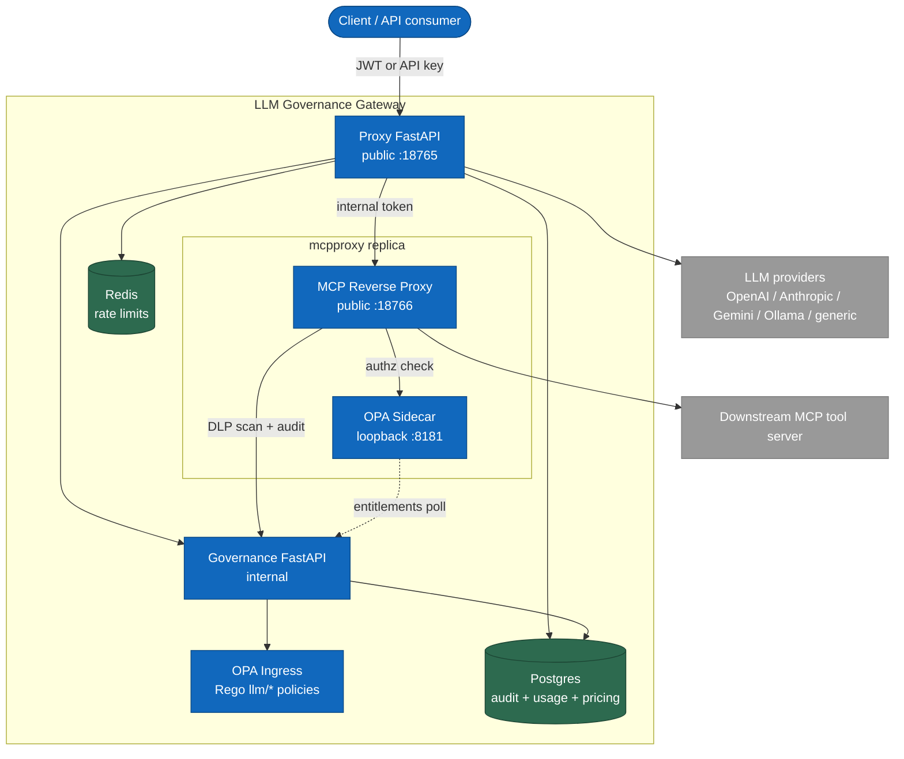

# LLM Governance Gateway

Production-grade OpenAI-compatible LLM gateway with policy enforcement, PII redaction, tenant-aware routing, rate limiting, and append-only audit logging.

## What it does

- Exposes OpenAI-compatible `POST /v1/chat/completions` and `POST /v1/responses` APIs.
- Routes requests across OpenAI, Anthropic, Google Gemini, Ollama, mock providers, and generic OpenAI-compatible backends.
- Authenticates callers with JWTs or provisioned API keys.
- Enforces per-tenant model access, tier-based RBAC, and provider override rules.
- Runs PII detection and pseudonymization before provider dispatch.
- Blocks PHI routing to non-approved providers by default.
- Blocks prompt-injection and banned-topic style harm signals before provider dispatch.
- Applies Redis-backed sliding-window rate limits per tenant/user.
- Writes append-only audit records to Postgres with tenant isolation via Row-Level Security.
- Runs local demos without real provider keys using `MOCK_PROVIDERS=true`.

## Repository layout

```text
.
├── proxy/                          # Public FastAPI gateway: auth, routing, adapters, rate limiting, usage dashboard
├── proxy/migrations/               # Proxy-owned Alembic migrations (usage_log, pricing)
├── governance/                     # Internal FastAPI governance service, PII/harm/policy/audit pipeline
├── governance/migrations/          # Governance-owned Alembic migrations (audit_log)
├── mcpproxy/                       # MCP Reverse Proxy: public MCP tool-call ingress, DLP checkpoint, audit
├── opa-sidecar/                    # Per-mcpproxy-replica OPA process (tool-call-boundary policy only)
├── policies/llm/                   # OPA Rego policies and tests for the ingress `opa` service
├── policies/mcp/                   # OPA Rego policies and tests for the `opa-sidecar` service
├── policies/data/                  # Generated OPA data documents (written by `make provision`)
├── config/                         # Seed tenants, users, model routing, and pricing config
├── pipelines/                      # PAS pipeline definitions (.dot)
├── scripts/                        # Provisioning, demos, partition rotation, Fly helpers
├── tests/integration/              # Docker Compose smoke tests
├── docs/                           # Architecture, demo scenarios, release notes, plans
├── docs/adr/                       # Architecture decision records
├── infra/example/fly.io/           # Optional Fly.io deployment examples
├── infra/terraform/                # Optional Terraform (e.g. Google DLP dev IAM access)
├── docker-compose.yml              # Local stack: proxy, mcpproxy, governance, OPA (ingress + sidecar), Postgres, Redis
├── docker-compose.google-dlp.yml   # Optional overlay: adds the Google DLP credential sentinel
└── Makefile                        # Main operator interface
```

## Architecture



| Node | Type | Description |
|---|---|---|
| Client / API consumer | Person | Human, CLI (Claude Code/Codex), or agent calling the gateway |
| Proxy FastAPI | Container | Public ingress; chat-completions/Responses/Messages APIs, auth, routing, rate limits, usage dashboard |
| MCP Reverse Proxy | Container | Public ingress for MCP tool calls, reachable only with the shared internal token the proxy holds |
| OPA Sidecar | Container | One process per `mcpproxy` replica, loopback-only; evaluates `policies/mcp/authz.rego` fresh per call, no caching |
| Governance FastAPI | Container | Internal only; PII, harm, policy, audit; also serves the MCP entitlements bundle and PII-scan endpoints |
| OPA Ingress | Container | Shared OPA instance; evaluates `policies/llm/*` for the LLM request path |
| Postgres | Container | Governance's audit log plus the proxy's usage log and pricing table |
| Redis | Container | Sliding-window rate-limit counters |
| LLM providers | External | OpenAI, Anthropic, Gemini, Ollama, generic OpenAI-compatible, mock |
| Downstream MCP tool server | External | Single configurable target today (`MCP_DOWNSTREAM_URL`); per-server routing is not yet built |

Two request paths:

**LLM request path** (chat completions, Responses, Messages)

1. Client calls the proxy with an OpenAI-compatible, OpenAI Responses, or Anthropic Messages request.
2. Proxy authenticates the caller and resolves tenant/user context.
3. Proxy checks the Redis sliding-window rate limit.
4. Proxy asks governance to inspect the request text.
5. Governance detects PII, pseudonymizes sensitive values, scores harm, and asks the ingress OPA for policy decisions.
6. Governance writes an audit record and returns allow/block/redacted-text metadata.
7. Proxy blocks the request or dispatches the redacted request to the selected provider.
8. Proxy computes cost from the pricing table, writes a usage log row, and returns the provider response with audit/rate-limit/usage headers.

**MCP tool-call path** (`POST /v1/mcp/{server}/call`)

1. Client calls the proxy; the proxy authenticates the caller and forwards the call to the MCP Reverse Proxy with the shared internal token.
2. The MCP Reverse Proxy asks its colocated OPA Sidecar for an authorization decision, evaluated fresh with no caching. While the sidecar is unreachable, a circuit breaker falls back to a static break-glass allow-list.
3. On deny, the MCP Reverse Proxy blocks the call and posts an audit event, without contacting the downstream tool.
4. On allow, the MCP Reverse Proxy calls the downstream MCP tool server and fully buffers the response (size- and time-capped).
5. Governance PII-scans the buffered response; any finding, cap breach, or scan error blocks the response (fail closed).
6. The MCP Reverse Proxy posts an audit event and returns the tool result to the caller.

See [Architecture](docs/architecture.md) for the deeper architecture notes.

## Quickstart

Prerequisites:

- Docker + Docker Compose v2
- Python 3.11+
- `uv`
- `make`
- Optional: `direnv`

Clone:

```bash
git clone https://github.com/<owner>/llm-governance-gateway.git
cd llm-governance-gateway
```

Configure local environment:

```bash
cp .envrc.example .envrc
# edit .envrc if you want real provider calls; mock mode works without provider keys
direnv allow
```

If you do not use `direnv`, export the variables in `.envrc.example` manually.

Generate local secrets:

```bash
export JWT_SECRET=$(python3 -c 'import secrets; print(secrets.token_hex(32))')
export GOVERNANCE_INTERNAL_TOKEN=$(python3 -c 'import secrets; print(secrets.token_hex(32))')
export GATEWAY_BOOTSTRAP_TOKEN=$(python3 -c 'import secrets; print(secrets.token_hex(32))')
export PSEUDONYM_HMAC_KEY=$(python3 -c 'import secrets; print(secrets.token_hex(32))')
export MOCK_PROVIDERS=true
```

Start the stack:

```bash
make up
make status
```

Run the seeded demo:

```bash
make demo
```

The demo starts the stack in mock-provider mode, provisions tenants/users/models, and runs six governance scenarios:

1. clean request allowed
2. PII redacted and allowed
3. PHI blocked for non-approved provider
4. prompt injection blocked
5. tier-2 model denied for tier-1 caller
6. rate limit exceeded

See [Demo scenarios](docs/demo-scenarios.md) for request/response examples and expected audit behavior.

For operator rollout steps, see [Onboarding users and routing agents through the gateway](docs/onboarding.md).

## Basic API usage

Health check:

```bash
curl http://localhost:18765/health
```

Chat completions:

```bash
TOKEN="replace-with-jwt-or-api-key"
curl -X POST http://localhost:18765/v1/chat/completions \
  -H "Authorization: Bearer $TOKEN" \
  -H "Content-Type: application/json" \
  -d '{
    "model": "gpt-5.6-luna",
    "messages": [{"role": "user", "content": "Hello"}]
  }'
```

The proxy also speaks two other client protocols on the same authentication and governance path:

- `POST /v1/responses` — OpenAI Responses API, for Codex-style clients.
- `POST /v1/messages` and `POST /v1/messages/count_tokens` — Anthropic Messages API, for Claude Code.

MCP tool calls go through a separate gated path:

- `POST /v1/mcp/{server}/call` — forwards to the MCP Reverse Proxy, which checks policy, calls the downstream tool, and DLP-scans the response before returning it.

The usage dashboard is a normal browser page on the proxy:

- `GET /dashboard` — usage/cost view, `admin` role sees the whole tenant, other roles see only their own API key.

Full request/response examples for every protocol are in [Onboarding](docs/onboarding.md).

Useful response headers:

- `X-Audit-ID` — audit record correlation ID when governance is reached.
- `X-Gateway-Pii-Redacted` — present when PII was redacted and the tenant config asks for notification.
- `X-Gateway-Pii-Types` — comma-separated PII entity types found.
- `x-ratelimit-limit-requests` — configured request limit for the window.
- `x-ratelimit-remaining-requests` — remaining requests in the current window.
- `x-ratelimit-reset-requests` — rate-limit reset timestamp.

## Make targets

| Target | Description |
|---|---|
| `make up` | Start the Docker Compose stack and wait for health checks |
| `make down` | Stop the stack |
| `make restart` | Restart all services |
| `make status` | Show container health/status |
| `make logs` | Follow service logs |
| `make migrate` | Run governance and proxy Alembic migrations |
| `make provision` | Seed tenants, users, models, and OPA data documents |
| `make onboard-help` | Show the onboarding CLI for users, service accounts, and endpoint snippets |
| `make demo` | Run the local six-scenario governance demo |
| `make test` | Run proxy and governance unit tests |
| `make test-integration` | Run Docker Compose smoke tests |
| `make opa-test` | Run OPA Rego policy tests |
| `make lint` | Run ruff and ty |
| `make rotate-partitions` | Rotate audit partitions |

## Configuration

Seed config lives in:

- `config/models.yaml` — model IDs, providers, base URLs, aliases.
- `config/tenants.yaml` — allowed models, rate limits, PII behavior, default provider.
- `config/users.yaml` — demo users and roles.

Important environment variables:

| Variable | Purpose |
|---|---|
| `JWT_SECRET` | Signs and verifies JWT callers |
| `GOVERNANCE_INTERNAL_TOKEN` | Shared internal token between proxy and governance |
| `GATEWAY_BOOTSTRAP_TOKEN` | Optional bootstrap/admin token |
| `PSEUDONYM_HMAC_KEY` | Key for deterministic PII pseudonymization |
| `DATABASE_URL` | Postgres connection string |
| `REDIS_URL` | Redis connection string |
| `OPA_URL` | OPA server URL used by governance |
| `MODELS_YAML` | Model routing config path |
| `MOCK_PROVIDERS` | Use local mock provider responses instead of external provider calls |
| `OPENAI_API_KEY` | OpenAI provider key |
| `ANTHROPIC_API_KEY` | Anthropic provider key |
| `GEMINI_API_KEY` | Google Gemini Developer API provider key (API-key path; see `GEMINI_VERTEX_*` below for the SA-authenticated Vertex AI path) |
| `GEMINI_VERTEX_PROJECT_ID` | GCP project id for the Vertex AI Gemini path; the Vertex client is only constructed at startup if this is set |
| `GEMINI_VERTEX_LOCATION` | Vertex AI region, e.g. `us-central1`, or `global`; no built-in default — required whenever `GEMINI_VERTEX_PROJECT_ID` is set |
| `GEMINI_VERTEX_CREDENTIALS_PATH` | Optional path to an impersonated-ADC credentials file; falls back to standard ADC discovery if unset |
| `GEMINI_VERTEX_EXPECTED_SERVICE_ACCOUNT` | Expected impersonated service-account identity for the Vertex AI path |
| `GEMINI_VERTEX_TIMEOUT_SECONDS` | Per-request HTTP timeout for Vertex AI calls; default `60` |
| `OLLAMA_BASE_URL` | Ollama/OpenAI-compatible local base URL |
| `MCPPROXY_URL` | MCP Reverse Proxy base URL used by the proxy to forward `/v1/mcp/{server}/call` |
| `GATEWAY_MCPPROXY_PORT` | Host port the MCP Reverse Proxy binds to (default `18766`) |
| `PII_BACKEND` | PII scanner: `google` for production, explicit `presidio` rollback/local fallback |
| `GOOGLE_CLOUD_PROJECT` | GCP project used for Sensitive Data Protection inspection |
| `GOOGLE_DLP_LOCATION` | DLP processing location; defaults to `global` |
| `GOOGLE_DLP_API_ENDPOINT` | Optional regional endpoint hostname for in-transit residency |
| `GOOGLE_DLP_EXPECTED_SERVICE_ACCOUNT` | Service account the governance container must run as when Google DLP is enabled |
| `GOOGLE_DLP_MIN_LIKELIHOOD` | Minimum Google finding likelihood; defaults to `POSSIBLE` |
| `GOOGLE_DLP_TIMEOUT_SECONDS` | DLP RPC timeout/retry deadline; defaults to 5 seconds |
| `GOOGLE_DLP_INFO_TYPES` | Comma-separated Google detector allowlist |
| `SPACY_MODEL` | spaCy model used only by the explicit Presidio rollback backend |

Never commit real `.envrc`, `.env`, provider keys, JWT secrets, HMAC keys, or database credentials.

See [Google Sensitive Data Protection PII backend](docs/google-sensitive-data-protection.md)
for IAM, ADC/workload identity, regional processing, cost/quota, live smoke, and
rollback instructions, including the full optional `google-credential-sentinel`
overlay (`docker-compose.google-dlp.yml`) variable list.

See [Vertex AI Gemini adapter](docs/google-vertex-ai-gemini.md) for the SA-authenticated
Vertex AI Gemini path: architecture, impersonated-ADC setup (never a raw service-account
key file), environment variables, and flagged risks still open before production use.

## Governance controls

Policy and control-plane defaults are intentionally strict:

- Fail closed when governance or OPA is unavailable.
- Deny by default in OPA; requests need explicit allow rules.
- PII findings store types/spans/scores, not matched raw values.
- Pseudonyms are deterministic HMAC-derived values, keyed by `PSEUDONYM_HMAC_KEY`.
- PHI is blocked from providers outside the approved BAA set.
- Audit rows are append-only and partitioned.
- Postgres RLS is enabled with `FORCE` for tenant isolation.

## Deployment notes

The repo includes optional [Fly.io example config](infra/example/fly.io/) for a split topology:

| App | Exposure | Role |
|---|---|---|
| proxy | Public HTTPS | Only internet-facing app |
| governance | Private/internal | PII, harm, OPA, audit pipeline |
| database/redis | Private/internal | State and rate limiting |

Do not expose the governance service, OPA, Postgres, or Redis directly to the public internet.

The MCP Reverse Proxy and OPA Sidecar are not yet part of this Fly.io example topology. Today they run only through `docker-compose.yml`; the MCP tool-call path is local/dev-only until Fly configs for them exist.

## Public release status

This codebase is suitable as a public reference implementation, but do not flip an existing private repository public until release checks pass.

Before publishing:

- Run a current-tree and git-history secret scan.
- Confirm no real tenant/user/provider credentials are tracked.
- Confirm `.envrc` and `.env` are ignored.
- Confirm the Apache-2.0 license is still the intended public license.
- Run `make test`, `make opa-test`, `make lint`, and `make test-integration`.
- Review [Public release checklist](docs/public-release.md).

## Security

See [Security policy](SECURITY.md).

For the boundary between gateway runtime checks, CI/release scanning, local developer hooks, and production/SIEM workflows, see [Secret detection boundaries](docs/secret-detection-boundaries.md).

## License

Apache License 2.0. See [LICENSE](LICENSE).
