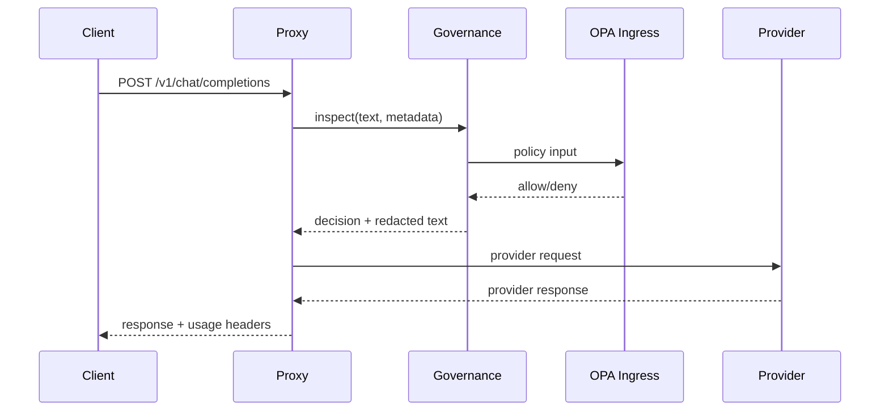
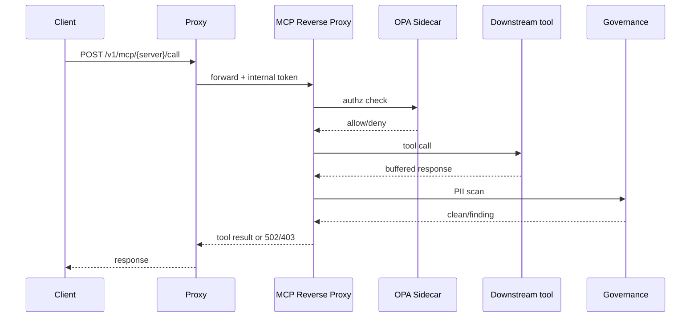

# Architecture

LLM Governance Gateway is a split-control-plane LLM proxy. The proxy owns client-facing compatibility and provider dispatch. The governance service owns safety, policy, audit, and data handling decisions.

## Components

| Component | Tech | Exposure | Responsibility |
|---|---|---|---|
| Proxy | FastAPI, asyncpg, httpx, Redis client | Public HTTP in local/dev; public HTTPS in deployment | OpenAI-compatible, Responses, and Messages APIs, authentication, tenant lookup, routing, rate limiting, provider dispatch, usage dashboard |
| MCP Reverse Proxy (`mcpproxy`) | FastAPI, httpx | Public port, but gated by a shared internal token only the proxy holds | Public ingress for `POST /v1/mcp/call`, calls the OPA Sidecar for authorization, buffers and DLP-scans tool responses, writes audit events, runs the break-glass circuit breaker |
| OPA Sidecar (`opa-sidecar`) | Open Policy Agent | Loopback only (`127.0.0.1:8181`), one process per `mcpproxy` replica | Evaluates `policies/mcp/authz.rego` fresh on every call, no decision caching; polls governance for its entitlements bundle |
| Governance | FastAPI, Presidio, spaCy, transformers (HF pipelines), asyncpg | Internal only | PII detection, pseudonymization, harm scoring, OPA policy calls, audit writes, MCP entitlements bundle, MCP PII scan endpoint |
| OPA Ingress (`opa`) | Open Policy Agent | Internal only | Rego policy decisions for model tiers, PHI/provider restrictions, provider overrides, evaluated from `policies/llm/*` |
| Postgres | Postgres 16 | Internal only | Governance's audit log, pseudonym map, and erasure log; the proxy's usage log and pricing table; bootstrap/provisioning state |
| Redis | Redis 7 | Internal only | Sliding-window rate-limit counters |
| Provider adapters | Python modules in `proxy/app/providers/` | Outbound only | OpenAI, Anthropic, Gemini, Ollama, generic OpenAI-compatible, mock provider |

"OPA Ingress" and "OPA Sidecar" are two separate OPA processes with separate policy bundles — see [Policy model](#policy-model) below.

## Request lifecycle

### LLM request path

1. Client sends `POST /v1/chat/completions` (or `/v1/responses`, or `/v1/messages`) to the proxy.
2. Proxy authenticates the caller with JWT/API-key logic.
3. Proxy loads tenant config and resolves the requested model/provider.
4. Proxy checks Redis rate limits before governance work.
5. Proxy sends request text plus caller/model metadata to governance.
6. Governance runs PII detection and redaction/pseudonymization.
7. Governance runs harm checks.
8. Governance sends policy input to the OPA Ingress instance.
9. Governance writes an audit row with decision metadata.
10. Proxy blocks or forwards the possibly-redacted provider request.
11. Proxy resolves the active pricing-table rate, writes a usage-log row, and returns the provider response plus audit/rate-limit/usage headers.



### MCP tool-call path

1. Client sends `POST /v1/mcp/{server}/call` to the proxy; the proxy authenticates the caller.
2. Proxy forwards the call to the MCP Reverse Proxy with the shared `X-Internal-Token`.
3. If the circuit breaker is closed, the MCP Reverse Proxy asks the OPA Sidecar for a fresh authorization decision. If the breaker is open (5 consecutive sidecar transport failures), it instead checks a static break-glass allow-list.
4. On deny, the MCP Reverse Proxy writes a `policy_denied`/`breakglass_denied` audit event and returns `403`, without calling the downstream tool.
5. On allow, the MCP Reverse Proxy calls the single configured downstream MCP tool server and buffers the full response (1 MiB / 10s caps; a breach fails closed).
6. The MCP Reverse Proxy sends the buffered text to governance's PII-scan endpoint. Any finding, cap breach, or scan error fails closed: audit `dlp_blocked`/`block`, return `502`.
7. On a clean scan, the MCP Reverse Proxy writes an `allow`-decision audit event and returns the buffered tool response to the caller.



## Fail-closed model

The system intentionally fails closed:

- Proxy returns `503 governance_unavailable` if governance cannot be reached.
- Governance blocks when OPA cannot return a policy decision.
- OPA policies default to deny and require explicit allow rules.
- PHI routing is denied unless the provider is in the approved BAA set.

This is the right default for a governance gateway. Availability loss is annoying; silent policy bypass is worse.

## PII and audit boundaries

PII handling is designed so sensitive raw values do not leave the governance boundary unless tenant policy explicitly permits it.

- Google Sensitive Data Protection detects production PII entities through a
  configurable, timeout-bounded `inspectContent` call. Presidio/spaCy remains
  only as an explicitly selected local/migration rollback backend.
- Detected values are replaced before provider dispatch when redaction is enabled.
- Audit records include PII entity metadata such as type, offset, and score.
- Audit records do not store the matched raw PII text.
- Pseudonyms are HMAC-derived using `PSEUDONYM_HMAC_KEY`.
- Right-to-erasure destroys the real-user-to-pseudonym link while keeping audit records for compliance.

Google receives the raw text being inspected in memory, with `include_quote=false`;
the gateway performs typed-marker replacement locally and never stores matched
text in audit records. Scanner errors fail closed and never auto-fallback to
Presidio. See [Google Sensitive Data Protection PII backend](google-sensitive-data-protection.md).

## Policy model

The gateway runs two separate OPA processes with disjoint policy bundles.

**OPA Ingress** loads `policies/llm/` and decides the LLM request path:

- `authz.rego` handles core allow/deny behavior.
- `allow_model.rego` handles model-tier access.
- `provider_override.rego` controls whether callers can force provider routing.
- Parity tests keep duplicated model-tier maps aligned.

**OPA Sidecar** loads only `policies/mcp/authz.rego`, an entitlement matrix keyed by role, tool, resource pattern, and `tenant_id`, evaluated fresh on every MCP tool call with no decision caching. See [Opa-sidecar Dockerfile hardening](#opa-sidecar-dockerfile-hardening-distinct-from-tenant-isolation-policy-fix) below for its build and tenant-isolation history.

Run policy tests with:

```bash
make opa-test
```

## Opa-sidecar Dockerfile hardening (distinct from tenant-isolation policy fix)

Commit `738d15f` ("fix(opa-sidecar): use multi-platform static OPA binary on
Alpine") and commit `dbeec12` ("fix(policies): enforce tenant_id scoping in
mcp authz.rego (ai-gateway-hwl)") landed close together on the long-running
`feat/ready-swarm` integration branch and are easy to mistake for one change.
They are not: they touch different files, fix different problems, and are
independently revertable. This section documents them separately, after the
fact, so review/revert history isn't stuck treating them as one unit.

**What the Dockerfile hardening does (`738d15f`, `opa-sidecar/Dockerfile`
only).** Before this commit, the `opa-sidecar` image's final stage was
`FROM openpolicyagent/opa:0.68.0-debug`, an amd64-only image, and ran as the
image's default (root) user. The commit rewrites the final stage as a
multi-stage build:

- A new `opa` stage (`FROM openpolicyagent/opa:0.68.0-static AS opa`) supplies
  a statically-linked, multi-platform OPA binary.
- The final stage switches its base to plain `FROM alpine:3.20` and copies
  the binary in (`COPY --from=opa /opa /opa`), instead of inheriting from the
  debug image.
- `USER 1000:1000` drops the process to a non-root user before the
  `ENTRYPOINT`/`CMD` that runs `opa run --server`.
- Alpine (rather than a fully-minimal `scratch`/distroless base) was kept
  deliberately: its bundled BusyBox `wget` is what the Compose-level
  healthcheck for this service uses (`docker-compose.yml`, `opa-sidecar`:
  `wget -q -O /dev/null http://127.0.0.1:8181/health?bundles=true`).

Why: the debug image's amd64-only manifest could not build or run natively on
arm64 (e.g. Apple Silicon dev machines), which blocked local verification
work. Switching to the static, multi-platform binary on Alpine fixes that,
and dropping to a non-root user is an independent, additive hardening step
taken at the same time. This change carries no policy logic of its own — it
does not touch `policies/mcp/authz.rego`, the entitlement matrix, or any
`allow`/`deny` rule.

**What the tenant-isolation policy fix does (`dbeec12`,
`policies/mcp/authz.rego` and `authz_test.rego`, ai-gateway-hwl).**
`authz.rego`'s `allow` rules previously matched only on
role/tool/resource-pattern and never checked `input.principal.tenant_id`, so
a principal holding a matching role could reach another tenant's MCP
resource through role/pattern match alone. The fix adds a `tenant_id` to
every `entitlements` entry and a fail-closed `same_tenant()` helper: both the
entitlement's and the principal's `tenant_id` must be present, non-null,
non-empty strings and equal, or the helper is undefined, the `allow` rule
falls through, and `default allow := false` applies. Seven new tests cover
cross-tenant deny (both the resource-pattern and no-resource-pattern allow
branches), the missing/null/empty `principal.tenant_id` boundary, and an
entitlement entry with no tenant scope recorded. This change carries no
container/build concerns of its own — it does not touch
`opa-sidecar/Dockerfile` or any image/base-image choice.

**Why they ended up together.** `738d15f`'s own commit message says the
Dockerfile hardening was "needed to build/run the sidecar for verifying the
ai-gateway-hwl tenant_id fix" — i.e. the Dockerfile change existed to let a
developer build and exercise the sidecar locally while validating `dbeec12`.
That is a practical/verification dependency, not a logical one: the two
commits touch disjoint files (`opa-sidecar/Dockerfile` vs.
`policies/mcp/authz.rego`/`authz_test.rego`), and per `git log`, `dbeec12`
merged into `feat/ready-swarm` via merge commit `6a06e1a` well before
`738d15f` was committed directly to the branch, separated by several
unrelated merges in between. Neither is a merge commit that literally
combines both diffs — both simply coexist, unmerged into `main`, on the same
long-running `feat/ready-swarm` integration branch, which is the "single
changeset" the two concerns risk being read as if that branch lands in
`main` as one PR/merge without this note. Reverting the Dockerfile hardening
does not reintroduce the cross-tenant authorization gap (that logic lives
entirely in `authz.rego` and its tests); reverting the tenant-isolation fix
does not require reverting the base-image/non-root change. See
[auth-architecture.md](auth-architecture.md) for the full sidecar design.

## Routing model

Model routing config lives in `config/models.yaml`.

Each model has:

- `id` — requested model name.
- `provider` — provider adapter.
- `base_url` — upstream base URL when applicable.
- `alias_of` — optional canonical model ID.

Tenant defaults and allowed models live in `config/tenants.yaml`. Demo users live in `config/users.yaml`. Per-model pricing rates live in `config/pricing.yaml` and seed the `pricing` table (see [Usage log, pricing, and dashboard](#usage-log-pricing-and-dashboard) below).

## Local deployment

Docker Compose starts:

- Postgres on host port `15433`.
- Proxy on host port `18765`.
- MCP Reverse Proxy on host port `18766`, gated behind the shared internal token.
- OPA Sidecar, reachable only over loopback from its paired `mcpproxy` replica (`network_mode: "service:mcpproxy"`), never as an independently addressable service.
- Internal governance service.
- Internal OPA Ingress service.
- Internal Redis service.
- Migration jobs for both governance and proxy (see [Independent Alembic instances](#usage-log-pricing-and-dashboard)).

Use:

```bash
make up
make provision
make demo
```

## Production deployment shape

The optional Fly.io examples in `infra/example/fly.io/` are intended for a split topology:

- Public proxy app is the only internet-facing service.
- Governance and OPA stay on private networking.
- Postgres and Redis stay private.
- Rotation/maintenance work runs through cron/one-off jobs.

Do not deploy governance or OPA as public services. That would be missing the point with confidence.

`infra/example/fly.io/` currently has no `mcpproxy` or `opa-sidecar` Fly configs. Today those two services run only through `docker-compose.yml`; treat the MCP tool-call path as local/dev-only until Fly configs for it exist.

## Usage log, pricing, and dashboard

The proxy tracks its own cost/observability data, separate from governance's compliance audit log. Term definitions (Usage Event, Usage Log, Pricing Table, Usage Visibility) live in [CONTEXT.md](../CONTEXT.md).

- `usage_log` (proxy-owned table): one row per authenticated request, with the real API key, token counts, cost, latency, and status (allowed/blocked/errored). Written by `proxy/app/usage_log.py` and `proxy/app/stream_usage.py`.
- `pricing` (proxy-owned table): versioned $/token rates per model with `effective_from`, seeded from `config/pricing.yaml`. The proxy resolves and locks the rate at request time, so historical cost does not shift when rates change later.
- `GET /dashboard` and `GET /dashboard/data` (`proxy/app/dashboard.py`) serve the usage dashboard. They live on the public proxy, not on internal governance — access is controlled by the existing `admin` role and tenant scoping, not by network placement.
- Proxy and governance each run their own independent Alembic migration history (`proxy/migrations/`, `governance/migrations/`), run by separate `proxy-migrate` and `migrate` compose jobs, since the two services own disjoint tables in the same database.

Design rationale is recorded in four ADRs:

- [0001: usage_log kept separate from audit_log](adr/0001-usage-log-separate-from-audit-log.md)
- [0002: pricing rate resolved and locked at request time](adr/0002-pricing-table-rate-at-request-time.md)
- [0003: Alembic added to the proxy service](adr/0003-alembic-added-to-proxy.md)
- [0004: dashboard mounted on the public proxy](adr/0004-dashboard-mounted-on-public-proxy.md)

## Further reading

[auth-architecture.md](auth-architecture.md) documents the MCP authorization design in more depth. Some of it describes what is running today — `mcpproxy`, the OPA Sidecar, `POST /v1/dlp/pii-scan`, the `policies/mcp/authz.rego` entitlement matrix, `GET /v1/mcp/entitlements-bundle` — and some of it describes a planned, not-yet-built design — a standalone Authorization Server/Zitadel, a GitHub Token Broker, a Cloud Credential Broker, RS256/JWKS auth, and a six-dimension audit schema. Read it as a design document, not a status report; this file (`architecture.md`) reflects what is actually running.
