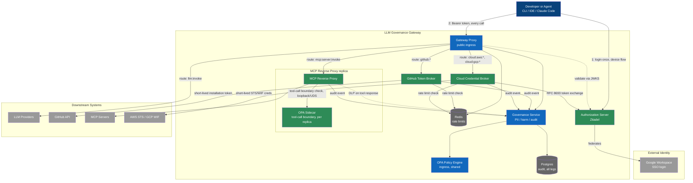
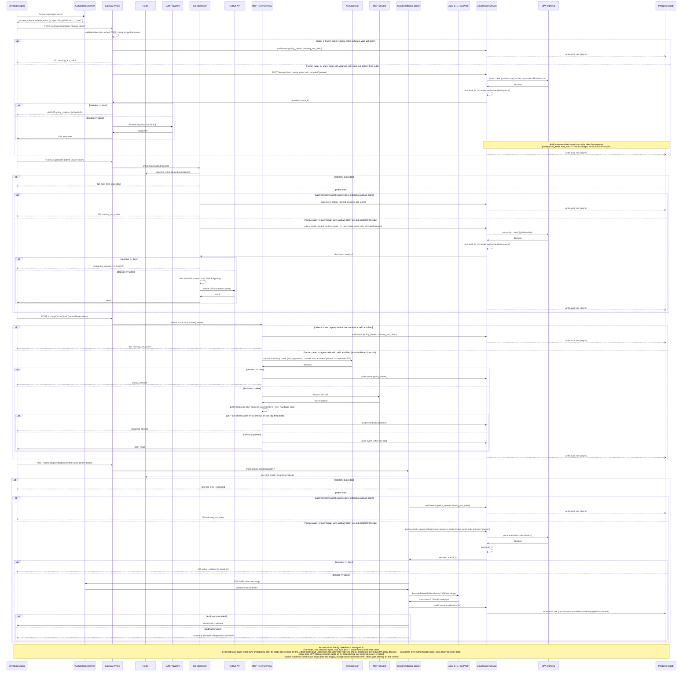
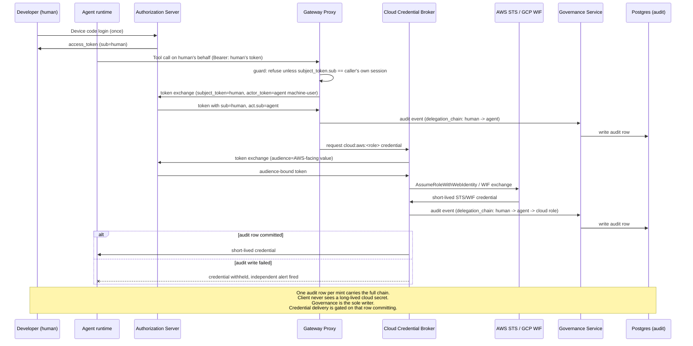

# Auth Architecture: Identity Broker + Gateway

## Shape of the system

One Authorization Server sits in front of everything and handles login exactly once, federating to Google Workspace for the actual credential check. It issues a single access token carrying multiple scopes (`llm:invoke`, `github:pr:write`, `mcp:<server>:invoke`). The existing Proxy stays the one ingress point for all traffic — it now validates that token instead of (or alongside) local JWT/API keys, then routes by path to one of four backends: the existing LLM dispatch, the GitHub Token Broker, the MCP Reverse Proxy, or the Cloud Credential Broker. All four legs emit audit events to the Governance Service, which is the sole writer to the audit table, so one query answers "what did this person/agent do" across every leg.

Nothing downstream (LLM providers, GitHub, MCP servers, AWS/GCP) ever sees a Google credential or a long-lived secret. They see short-lived, narrowly-scoped tokens the gateway mints or forwards.

## Container diagram



| Node | Type | Role |
|---|---|---|
| Developer or Agent | Person | CLI, IDE, Claude Code — any caller |
| Google Workspace | External | Actual login/credential check |
| Authorization Server | New | Device/PKCE flows, token issuance+refresh+revocation, multi-scope tokens, RFC 8693 token exchange |
| Gateway Proxy | Existing, extended | Public ingress, now validates AS tokens, routes by scope |
| Governance Service | Existing, extended | PII, harm, audit; sole writer to the audit table — the other three new components and the proxy send it audit events rather than writing Postgres directly; also exposes the dedicated PII-only `POST /v1/dlp/pii-scan` endpoint the DLP checkpoint MCP Reverse Proxy calls on tool responses (shares the same process-wide Presidio analyzer/anonymizer — no second copy embedded — but is a separate route from `/inspect`, with no LLM-policy fields or checks) |
| OPA (ingress) | Existing, extended | Policy decisions at ingress — can this token use this route/scope — unchanged shared instance, one failure domain |
| OPA Sidecar (tool-call boundary) | New | Separate OPA process, one per MCP Reverse Proxy replica, colocated on the same pod/host, reached over loopback/UDS — not the ingress instance, not a remote hop; evaluates tool + arguments + context fresh on every call, own failure domain |
| GitHub Token Broker | New | Holds GitHub App key, mints 1hr installation tokens |
| MCP Reverse Proxy | New | Validates per-server/per-tool scope via its colocated OPA sidecar, terminates MCP JSON-RPC/SSE transport, buffers and DLP-scans each tool response before forwarding |
| Cloud Credential Broker | New | Server-side RFC 8693 exchange of the caller's token for short-lived AWS STS / GCP WIF credentials — proxy-mediated so the mint stays on the one audited path |
| Postgres | Existing, extended | Audit sink for all four legs; only Governance holds a DB edge and writes to it, six-dimension schema (see below) |
| Redis | Existing, extended | Rate limiting — was LLM-route-only (`proxy/app/main.py:297`); now also checked inside the GitHub Token Broker and Cloud Credential Broker legs before their policy check, route-scoped so one leg's traffic doesn't consume another leg's budget (see "Rate limiting" design decision below). MCP tool-call volume is bounded separately, by the per-call tool-call-boundary OPA sidecar check, not by this limiter. |

## Runtime flow



## What's new vs. what's reused

- **New:** Authorization Server (Zitadel instance in docker-compose), GitHub Token Broker, MCP Reverse Proxy, Cloud Credential Broker, OPA Sidecar (a second, separate OPA process colocated per MCP Reverse Proxy replica for the tool-call boundary check — not an extension of the shared ingress OPA instance).
- **Extended:** Proxy's `authenticate()` gets an RS256/JWKS validation path against the AS, checked for scope per route. Governance gains an MCP-response DLP checkpoint. Audit schema gains six new columns for the six-dimension schema (see "Physical schema migration" below), not just delegation-chain/approval-status. Redis rate limiting extends from LLM-route-only to also gate the GitHub Token Broker and Cloud Credential Broker legs (see "Rate limiting" design decision below).
- **Unchanged:** Provider dispatch.

---

## Design decisions from gap-analysis research

Two research passes — competitor/reference gap analysis, then deep dives on the questions it raised — were run against this design. Findings that change or firm up the shape above:

### Scope & entitlement model: coarse tokens, matrix lives outside Zitadel

Zitadel RBAC (project roles + org grants) is built for a small, human-managed role list, not N-servers × M-tools of scopes — minting one scope per server×tool doesn't fit the product and doesn't scale past a handful of MCP servers. Decision: Zitadel issues one coarse `mcp:invoke` scope plus a handful of project roles (`mcp-role:read-only`, `mcp-role:github-write`, ...) — small enough to satisfy the SOC2 access-review control below. The actual `mcp:<server>:<tool>` entitlement matrix lives **outside** Zitadel, as an OPA data document keyed by role, resolved at the MCP Reverse Proxy/OPA layer per call. Entitlement changes take effect within a bounded staleness window of ≤10 seconds, no token reissuance — see the OPA bundle-polling mechanism below. (Kong AI Gateway uses the same consumer-group-ACL shape; its own propagation timing is a separate implementation detail, not assumed to match this bound.)

### Policy enforcement: two evaluation points, two separate OPA processes

OPA runs at two points, as two entirely separate processes with no shared runtime or data plane between them — not one shared service serving both:

1. **Ingress OPA** (existing, unchanged) — one shared instance, called by the Governance Service, decides whether a token can use a given route/scope from token claims alone. It does not consume the entitlement-matrix data document below.
2. **Tool-call-boundary OPA sidecar** (new) — a distinct OPA server process, one per MCP Reverse Proxy replica, colocated on the same pod/host and reached over loopback/Unix domain socket, never a cross-service network hop. It evaluates tool + arguments + context fresh on every call (no decision caching).

**GitHub PR creation and Cloud Credential minting each get an argument-aware, fail-closed per-action check too — equivalent in kind to the MCP tool-argument check, not scope-check-only.** Both evaluate against the shared ingress OPA instance (item 1 above), not the sidecar — neither leg is on the sub-millisecond hot path the sidecar exists for, so the extra network hop to ingress OPA is a non-issue. Each gets its own Rego package, distinct from `llm/authz` and from the MCP entitlement-matrix data document: `github/authz` takes `{action: "create_pr", repo, base, actor}`, `cloud/authz` takes `{role or account requested, resource, environment}`. This is a per-action decision, not a new entitlement-matrix/data-document scheme — no data-document design is introduced here.

**Decision: colocated sidecar, not in-process/WASM.** A full OPA server process running as a sidecar was chosen over embedding OPA in WASM mode inside the MCP Reverse Proxy. Reasons against WASM: it exposes a restricted builtin set, and it has no native hot-data-reload — updating the entitlement-matrix data document a WASM module holds requires recompiling and redeploying the module, not just refreshing a bundle. The sidecar approach gets the bundle-polling mechanism below (and its ≤10s staleness bound) natively, with the full OPA builtin set, at the cost of a loopback/UDS call instead of a true in-process function call — still sub-millisecond to low-single-digit-ms overhead, consistent with the latency goal, without the WASM data-reload gap. Choosing WASM would mean building bespoke data-injection plumbing to hit the same ≤10s bound the sidecar gets for free.

**Blast radius: the two OPA processes fail independently.** Because ingress OPA and the tool-call-boundary sidecar are separate processes in separate failure domains, an ingress OPA outage does not disable MCP tool-call enforcement, and a sidecar crash on one MCP Reverse Proxy replica does not affect ingress routing decisions or other replicas' sidecars. Each leg's break-glass path (below) triggers independently on its own OPA's unreachability.

What's cacheable is the entitlement *data*, not the *decision*.

**Decision: short global bundle-poll interval on the sidecar, not a per-session cache.** The tool-call-boundary OPA sidecar's native bundle service (`polling.min_delay_seconds: 5`, `max_delay_seconds: 10`) polls Governance's entitlement-data endpoint on a fixed schedule, global to that sidecar — not keyed by session, and not something the ingress OPA instance participates in at all, since ingress OPA never loads this data document. This bounds worst-case staleness at **≤10 seconds** from a role/entitlement change to it taking effect on every open session's next tool call: decisions are already evaluated fresh per call (no decision caching, above), so the instant a given replica's sidecar refreshes its bundle, the very next call through that replica picks it up, with no further per-session lag stacked on top of the poll interval. This replaces the per-session bundle cache this design previously described, which had no native OPA equivalent and no invalidation path of its own — bundle polling is a real, built-in OPA capability, not bespoke plumbing. Two other real options were considered and not chosen pre-POC: push-based invalidation via OPA's Data API (`PUT /v1/data/{path}`) would cut staleness closer to zero but needs a revocation-event → OPA-PUT pipeline wired up, more moving parts than a POC needs; per-request data lookup (`http.send` from Rego) would reintroduce a network hop into the hot path, contradicting the colocated low-latency goal above.

Input shape:

```json
{
  "principal": {"user_id": "user_01HXKP2M", "tenant_id": "tenant_acme", "roles": ["mcp-role:github-write"]},
  "actor": {"agent_id": "agent_client_7f3n", "session_id": "sess_9xk2m7"},
  "tool": {"server": "github-mcp", "name": "create_pr", "arguments": {"repo": "...", "base": "main"}},
  "context": {"environment": "prod", "resource": "repo:org/name", "prior_calls_this_session": 4}
}
```

**`context.resource` is not decorative — it is checked, but only for entitlement entries that declare a resource pattern.** The entitlement matrix isn't pure role→tool mapping: each `(role, server, tool)` entry may additionally declare a `resource_pattern`, and when it does, the sidecar's Rego rule requires `context.resource` to glob-match that pattern before allowing, denying an otherwise role/tool-eligible call whose resource falls outside it. See `policies/mcp/authz.rego` for the concrete, testable example — its `mcp-role:github-write` → `github-mcp`/`create_pr` entry restricts `context.resource` to `repo:org/*`, denying (for example) `repo:otherorg/name` even though the role and tool both match; `policies/mcp/authz_test.rego` covers the match, mismatch, and no-pattern-declared cases. (Pre-POC: this Rego is illustrative, run only by `make opa-test`, since the MCP Reverse Proxy and its OPA sidecar don't exist as running code yet.)

**Design note: resource-level scoping is optional per tool, not mandatory for every entry.** A tool without a natural single-resource concept (for example a listing/search tool, see `mcp-role:read-only` → `list_prs` in `policies/mcp/authz.rego`, which declares no `resource_pattern`) is governed by role→tool matching alone, and `context.resource` is not evaluated for it — it may be absent or ignored in the input without affecting the decision. Only a tool whose entitlement entry declares a `resource_pattern` gets the additional check. This means the field's presence in the input shape above does not imply it is always enforced: whether it is checked depends on the tool's own entitlement entry.

Log `model_refused` (the model declined on its own) and `policy_denied` (OPA blocked it) as structurally distinct audit event types — conflating them destroys the ability to reconstruct what actually stopped an action later.

### Rate limiting: extend Redis checks to the GitHub and Cloud Credential legs

`rate_limiter.check()` (`proxy/app/main.py:297`) enforces today only on the LLM route, keyed on `f"{tenant_id}:{user_id}"`, rejecting with `429 rate_limit_exceeded` (plus `Retry-After` and rate-limit headers) once the bucket is full. Before this decision, the GitHub Token Broker and Cloud Credential Broker legs had no rate limit of any kind — a materially different risk than the container diagram's blanket "Redis — unchanged" implied, since both legs mint real external credentials or create real GitHub PRs, not just forward an LLM call.

**Decision: extend the same limiter, route-scoped, to both legs — before their policy check, not after.** Each of the GitHub Token Broker and Cloud Credential Broker calls `rate_limiter.check()` against its own route-scoped key (`f"{tenant_id}:{user_id}:github"` / `f"{tenant_id}:{user_id}:cloud"`) immediately after its scope check and before the Gov/OPA per-action decision (see runtime-flow diagram above), returning the same `429`/`Retry-After`/rate-limit-header contract as the LLM route on a full bucket. Route-scoping the key, rather than sharing one bucket across all three legs, means a caller hammering `/v1/github/pr` cannot exhaust the budget the LLM or Cloud Credential route would otherwise have available to that same tenant/user pair.

**MCP tool calls are not on this limiter.** MCP traffic volume is already bounded per-call by the tool-call-boundary OPA sidecar above, which evaluates fresh on every call; adding a second, redundant volume control there is out of scope for this decision.

### Agent identity, delegation, and cloud credentials — one RFC 8693 mechanism, two uses

Zitadel's native OAuth token exchange (RFC 8693) supports the `act` claim for real, not as a workaround: Gateway Proxy calls token exchange with `subject_token` = the caller's own session token and `actor_token` = one Zitadel machine-user per **agent type** (not per human), holding the `ORG_END_USER_IMPERSONATOR` role. Result token: `sub` = the human, `act.sub` = the agent — genuine "agent X acting for user Y," logged into the audit table's delegation-chain column.

**Caveat that has to be enforced by us, not Zitadel:** the impersonation role is coarse — an agent machine-user holding it can request an `act` token for *any* org user, and Zitadel's `resource` parameter isn't supported on this flow to narrow that. So the Gateway Proxy must refuse the exchange unless `subject_token`'s `sub` matches the session actually calling it. Zitadel does not enforce that binding for us.

**Per agent type, not per instance — one shared secret, bounded by rotation, not by attestation.** The machine-user client credential is minted once per agent type, not once per running instance: every replica of that agent type authenticates as the same Zitadel machine-user and presents the same client secret to obtain an `actor_token`. This is a distinct question from, and in addition to, the "not per human" scoping above — the compensating control here targets secret leakage, not impersonation-scope coarseness (that risk is separately handled by the `subject_token.sub`-binding caveat immediately above, and is not restated here). The compensating control: the client secret is short-lived and rotated on a bounded TTL (e.g. 24h), with a current+next overlap window during rotation so in-flight instances don't fail mid-cycle — a leaked secret therefore has a bounded useful life instead of being valid indefinitely. Instance-bound attestation (e.g. mTLS or workload-identity binding scoped to a single replica) was considered and explicitly deferred: Zitadel's machine-user client-credentials flow has no native equivalent to bind a secret to one workload identity, and building that binding ourselves is out of scope pre-POC.

**Detection and containment for a suspected-compromised machine-user secret.** Containment is one action, not a per-instance fan-out: rotating (or revoking) that agent type's shared client secret invalidates it for every running instance simultaneously, and any subsequent token-exchange call from any instance fails closed immediately. Detection reuses data and an alerting pattern the doc already commits to rather than inventing new plumbing: an anomaly rule over the `delegation_chain`/`act.sub` audit data (for example, one machine-user's `act` token exchanges spanning an unusually large number of distinct human `sub`s, or a token-exchange volume spike for that agent type) fires the same synchronous alert already used for break-glass invocation (see "Compensating controls" below).

The same RFC 8693 mechanism generalizes into the Cloud Credential Broker: exchange the Zitadel token server-side for AWS STS (`AssumeRoleWithWebIdentity`, IAM OIDC provider trusts Zitadel's issuer) or GCP Workload Identity Federation (no issuer allowlist — a self-hosted Zitadel is directly usable) credentials. **Proxy-mediated, not client-direct** — a client-direct path (client calls Zitadel then AWS/GCP itself) would create a second, unaudited credential-mint path and break the one-audit-table goal. One audit row per mint carries the full chain: human → agent → cloud role.

**Credential delivery is gated on that row committing.** The Cloud Credential Broker holds the minted STS/WIF credential until Governance confirms the audit `INSERT` succeeded, and only then returns it to the caller — an audit-write failure here must not release the credential regardless of cause. This is a deliberate departure from the fire-and-forget default described in the audit-table section below: the withheld credential is inert until its short TTL naturally expires, so "don't deliver" gives the same practical guarantee as "don't mint," without needing a mid-flight revoke call most STS/WIF token types don't cleanly support.

**Ingress requires the act claim uniformly — chat, github, mcp, and cloud, not just MCP.** A request from a known agent-runtime client ID is rejected at the Gateway Proxy with `401 missing_act_claim` unless it carries a valid `act` claim whose `act.sub` is distinct from `sub` — checked immediately after the leg's scope check and before any Gov/OPA policy decision or external call. A bare human bearer token replayed from an agent-runtime client ID hits this same rejection rather than being silently treated as a human-originated call: the check keys off the caller's registered client ID, not off whichever token shape happens to be presented. This is an authentication-shape gate at the ingress boundary, distinct from the RFC 8693 exchange mechanism above (which mints the act claim in the first place) and from the per-action OPA decisions each leg makes afterward. Both the human `sub` and the agent `act.sub` flow through to each leg's policy-check payload so a valid delegated call is recorded with both identities in the audit row, not just the human's.

### tenant_id origin and propagation

`tenant_id` is already structurally load-bearing today — `proxy/app/auth.py`'s `CallerContext.tenant_id` is a required field, gating model selection (`get_tenant_info`), the per-tenant rate-limit key (see "Rate limiting" above), and API-key tenant isolation on creation — so every new component and example in this design carries it too, not as new plumbing but as the same value flowing through.

**AS-authenticated (non-delegated) callers.** `tenant_id` originates as a claim on the Zitadel-issued access token, mapped from the caller's Zitadel org membership. This is the same shape as today's local-JWT path (`claims.get("tenant_id")`, `proxy/app/auth.py:85`), just backed by Zitadel org membership instead of the local HS256 secret — a missing claim is rejected the same way today's local-JWT path already rejects one (`auth.py:88`, `token missing required claims`).

**Delegated callers.** The RFC 8693 token exchange above does not renegotiate `tenant_id`. Only `act.sub` is added to the exchanged token; `sub` stays the human's own subject, so `tenant_id` flows through unchanged from the human's subject token. The agent machine-user contributes no `tenant_id` of its own — it's shared across all tenants for a given agent type (see "Per agent type, not per instance" above), so it isn't tenant-scoped and can't be. For a delegated call, `CallerContext.tenant_id` is always the human's tenant, never the agent runtime's.

**Flow into RLS: no new plumbing needed.** The only Postgres RLS policy on `audit_log` is `audit_read`, `FOR SELECT` (`governance/migrations/versions/001_initial_schema.py`) — there is no `INSERT`/`ALL` policy. RLS session variables (`app.current_tenant_id`, `app.current_scope`, reset on pooled-connection checkout in `governance/app/db.py:21-29`, `SET LOCAL` per request) govern *reads*, scoping which rows a caller can see; they do not gate *writes*. Every new leg's writer needs only to submit `tenant_id` as a plain column value in its audit-fact payload to Governance's existing internal write endpoint (see "Write-access model" below) — the same way `user_id` and every other existing column is supplied today. The existing SELECT-time RLS scoping then applies uniformly to that row, regardless of which leg wrote it, with no new RLS design required.

**Flow into rate-limit keys.** Already covered by the "Rate limiting" design decision above — the GitHub Token Broker and Cloud Credential Broker legs key their Redis checks on `f"{tenant_id}:{user_id}:github"` / `f"{tenant_id}:{user_id}:cloud"`, using the same `tenant_id` sourced as described above. Not restated here.

**Out of scope for this section.** The `github/authz` and `cloud/authz` per-action check payloads (inline prose shapes above) and the runtime-flow diagram's policy-check payloads don't spell out `tenant_id` field-by-field; that's a diagram/prose economy choice, not an omission of the value itself, since `tenant_id` is already carried on `CallerContext` for every leg by the time it reaches those checks.

### DLP on MCP tool responses

Checkpoint sits after the downstream MCP server's response is received and before it's forwarded to the client — same hop as the spec-mandated audience/schema checks. Call the Governance service's dedicated `POST /v1/dlp/pii-scan` endpoint (`governance/app/main.py`) on the serialized response body, then block/alert or anonymize before forwarding.

**Not `/inspect` — a separate, PII-only endpoint.** `POST /inspect` requires `model_id` and `routing_method` and unconditionally runs `harm_opa_stage` (prompt-injection/harm classifier plus the `llm/authz` Rego policy — model tiers, PHI-provider gating), fail-closed on any OPA error. Tool-response bodies have no natural `model_id`/`routing_method` and have nothing to do with the `llm/authz` policy domain. `POST /v1/dlp/pii-scan` takes only `{"text": str}`, calls `governance/app/pii.py`'s `run()` directly, and returns PII findings, data classification, and redacted text — no `decision`, `harm_score`, `violations`, or `audit_id` fields, and no `llm/authz` evaluation. It reuses the same process-wide Presidio analyzer/anonymizer singletons as `/inspect` (`governance/app/pii.py:17-19`), so there's still no second copy of the NLP models loaded, but the route, request contract, and policy scope are entirely separate from `/inspect`. **Design note:** the MCP Reverse Proxy never constructs synthetic or placeholder `model_id`/`routing_method` values to satisfy `/inspect`'s schema — that pattern is deliberately avoided by giving this checkpoint its own endpoint with its own, narrower contract.

**Always buffer, never stream tool responses through this checkpoint.** Presidio has no streaming API — same approach the reference implementation (Strac) uses — so the MCP Reverse Proxy always fully buffers a tool response server-side before it does anything else with it, regardless of whether the downstream MCP server sent it as a single JSON-RPC message or as SSE chunks. It does not pass incremental SSE chunks through to the client for tool-call responses; true end-to-end streaming is not offered on this path pre-POC (see open questions below). Forwarding not-yet-scanned chunks to preserve streaming UX would create an unscanned pass-through gap, which the project's fail-closed posture (`docs/architecture.md:39`) rules out.

**Bounded, and enforced while receiving, not after.** The buffer is capped at 1 MiB, matching the existing `MAX_BODY_SIZE` convention (`proxy/app/middleware.py:7`, `governance/app/main.py:52`): the running total is checked per chunk as bytes arrive from the MCP server, and the transfer is aborted the moment the cap is breached, the same enforcement style as `BodySizeLimitMiddleware` rather than a post-hoc check after full receipt. Two timeouts bound the checkpoint as a whole, covering "too big" and "too slow" as distinct failure modes: a ~10s wall-clock cap on receiving the buffered body, and a 5s cap on the Presidio scan call itself, reusing the existing per-hop timeout convention (`governance/app/opa.py:33`).

**Fails closed — a deliberate divergence from the harm-scan precedent.** If the Presidio scan errors, times out, or the response exceeds the size cap, the MCP Reverse Proxy blocks the tool response outright rather than forwarding it unscanned or degrading silently. This differs from the existing harm-scan path (`governance/app/pipeline.py:45-46`), which fails open on scanner error — that precedent is not silently inherited here, consistent with the project's stated fail-closed default (`docs/architecture.md:39`).

**Shares the Governance Presidio pool with ingress LLM PII scans — bounded so MCP traffic can't starve ingress traffic.** Both paths route through the same process-wide analyzer/anonymizer pair via bare `asyncio.to_thread` (`governance/app/pii.py:17-19,66-68`), which has no concurrency limit today. Decision: bound total concurrent Presidio invocations behind a single shared semaphore inside Governance, sized to the executor's worker count, so MCP DLP calls queue instead of competing unboundedly with ingress calls; combined with the 5s scan timeout above, this caps the worst-case queuing delay an MCP-heavy workload can impose on ingress traffic. Flagged as a POC-build implementation detail — the component doesn't exist yet — a dedicated/split pool per traffic type is a possible future refinement, out of scope pre-POC.

**Gap flagged, not solved:** Presidio is text-only; binary/OCR tool responses (images, attachments) have no coverage without a separate OCR pre-pass. Scoped out of the POC unless a specific target MCP server is known to return binary payloads.

### Break-glass path for when OPA is down

1. **Narrow, per-leg allow-list — never a scope-gated bypass.** Skipping the OPA call must not fall back to the coarse token scope (`mcp:invoke`, `llm:invoke`, `github:*`, `cloud:*`) as the de facto authorization boundary — those scopes are deliberately coarse (see "Scope & entitlement model"), so treating them as sufficient once OPA is skipped is a full policy-engine bypass in practice, not a narrowed one. Instead, each leg falls back to an explicit, OPA-independent, statically-declared capability set:
   - **LLM dispatch:** allowed. PII/harm scanning runs independently of the OPA call (`governance/app/pipeline.py`) and stays on; only the OPA policy decision itself is skipped.
   - **MCP tool calls:** allowed only for a static, pre-named read-only tool allow-list shipped in Gateway Proxy config — never sourced from the entitlement-matrix data document, since that document is only reachable through the very OPA sidecar that's down.
   - **GitHub PR creation:** denied outright. No safe static subset of an argument-aware, mutating action exists.
   - **Cloud credential minting:** denied outright — highest blast radius of any leg.

   Zitadel is a different failure domain and stays the trust anchor throughout — never fall back to "no auth" because OPA is unreachable.
2. **Pre-provisioned, not self-service:** a small named set of admin identities carry a distinct `breakglass:emergency-access` scope, granted out-of-band in advance — never mintable at request time.
3. **Triggers on unreachability, never on DENY — with explicit numeric thresholds.** The fail-closed branch keys off a circuit-breaker/health-check failure to OPA (timeout/connection refused/5xx), never off OPA returning a policy deny — conflating those two signals turns break-glass into a policy bypass.
   - **Timeout:** reuses the existing 5.0s OPA client timeout (`governance/app/opa.py`) — no second value is introduced.
   - **Trip threshold:** 5 consecutive failed calls (timeout, connection refused, or 5xx; a DENY response never counts toward this).
   - **State scope:** the failure counter is shared across requests, not re-evaluated per request — held in-process per replica. Each Governance replica keeps its own counter for ingress OPA, and each MCP Reverse Proxy replica keeps its own counter for its colocated sidecar, consistent with the "two OPA processes fail independently" principle above.
   - **Reset:** open → half-open → closed. While open, the breaker stays tripped for a 30s cooldown, then issues a single half-open probe call. A successful probe closes the breaker and resumes normal per-request OPA enforcement immediately; a failed probe reopens the breaker and restarts the 30s cooldown. No manual reset is required for OPA recovery itself.
4. **Compensating controls:** mandatory step-up MFA re-auth at time of use, short automatic TTL (single request or ~15 min), synchronous alert fired the instant the path is invoked, a distinct `is_breakglass=true` audit event type, forced automatic expiry. The synchronous alert's delivery is independent of the `audit_log` write — see the deliberate carve-out in the audit-table section below — so a database outage (plausibly the same failure that triggered break-glass) cannot silently take out both the audit row and the only signal that break-glass was invoked.
5. Second-admin approval (the gap between "acceptable POC" and "production-grade") is deferred — see open questions below.

### Audit table: adopt the six-dimension schema now

Postgres audit is the one piece of infrastructure that's a gap-multiplier across every leg above — decisions made here are cheap now, before four independent legs (LLM dispatch, GitHub Broker, MCP Reverse Proxy, Cloud Credential Broker) are all generating audit events, and expensive after. Adopt the schema now. The six dimensions: user identity, agent identity, authorization scope, action (tool + arguments + result), delegation chain, approval status — `session_id` is a correlation key and `event_type` a classification tag, not one of the six; `tenant_id` is carried on every event too, but it's the existing `audit_log.tenant_id` column (`governance/migrations/versions/001_initial_schema.py`), not a new one — see "tenant_id origin and propagation" below:

```json
{
  "session_id": "sess_9xk2m7",
  "tenant_id": "tenant_acme",
  "user": {"id": "user_01HXKP2M"},
  "agent": {"id": "agent_client_7f3n"},
  "authorization": {"scopes": ["documents:read"]},
  "action": {"tool": "read_document", "arguments": {"document_id": "doc_88pk3r"}, "result": "..."},
  "delegation_chain": [{"actor": "user_01HXKP2M", "role": "initiator"}, {"actor": "agent_client_7f3n", "role": "delegate"}],
  "approval_status": "granted",
  "event_type": "tool_invoked"
}
```

**Delegation-chain provenance: derive from the in-hand token, never from a prior audit-table read.** Every writer builds `delegation_chain` only from identity/credential material it already holds for *this* request — the bearer token's own `sub` and `act.sub` claims (present on every leg's policy-check call in the runtime-flow diagram above: GW→Gov at line 120, GH→Gov at line 143, MCP→OPASC at line 166, CB→Gov at line 193), plus, where applicable, the credential just minted in the same call (GitHub installation token at line 151, STS/WIF cloud role in the delegation-flow diagram below). No writer queries `audit_log`, or any other prior state, to reconstruct a chain. This is safe because `sub`/`act.sub` are cryptographically bound to the token itself — there is no ordering dependency on any earlier write, unlike a database read racing against not-yet-committed rows.

Also cheap now / expensive later: restrict UPDATE/DELETE grants on the audit table (SOC2 tamper-evidence, one GRANT statement); log denials as well as grants; `is_breakglass` and `policy_denied` vs `model_refused` as distinct `event_type` values; adopt OTel GenAI span naming (`gen_ai.operation.name`, `execute_tool`) for field vocabulary instead of inventing bespoke names; decide retention/hot-cold tiering now even before a cold tier exists (6-year minimum baseline, 90-day-hot is typical). The 6-year floor is HIPAA's requirement, not SOC 2's 1-year one: `policies/llm/authz.rego`'s `phi_approved_providers`/`deny` rules already gate PHI-provider routing today, so PHI is in-scope now, not deferred, and the `audit_log` schema has no per-row PHI/`data_classification` column to retain PHI rows on a separate, shorter schedule — a single table-wide baseline has to cover the strictest applicable regime. This resolves the retention-duration question left open in `docs/gaps/2026-05-26-pre-build-gaps.md` ("Gap 6: Audit Log Retention and Access Control Policy"), which listed HIPAA (6yr) / GDPR Art. 30 (~3yr) / SOC 2 (1yr) as candidates without picking one. Gap 6's other two sub-questions — who may read the audit log, and the GDPR-erasure mechanism for an append-only table — are unrelated to retention *duration* and remain open.

**Write-access model: Governance only, no exceptions.** Only the Governance Service holds a database credential and issues `INSERT`s against `audit_log`; this matches what's already built — `governance/app/audit.py` is the only code that writes the table today, the proxy's existing audit routes are read-only proxies to Governance over HTTP, and every service currently shares one Postgres role with no per-service credential story to draw on. The GitHub Token Broker, MCP Reverse Proxy, and Cloud Credential Broker do not get a `pg` edge or a database credential of their own — each sends its audit facts to Governance (an internal, `X-Internal-Token`-authenticated write endpoint, same auth pattern the proxy's existing read routes use) and Governance performs the insert. This is a deliberate choice, not an oversight: adding three more network-reachable principals with direct write access to a tamper-evidence-relevant table would multiply risk for no stated benefit, and it reuses the append-only enforcement already migrated in `001_initial_schema.py` — the `gateway_app` role's `INSERT`-only grant (`UPDATE`/`DELETE`/`TRUNCATE` revoked), forced RLS, and the `deny_audit_mutation` trigger — instead of designing new per-broker credential scoping from scratch. If a future requirement (e.g. audit writes must survive a Governance outage) forces brokers to write independently, that needs its own credential-provisioning design as a separate follow-up, not a quiet exception carved into this model.

Because this internal write endpoint is already the one structurally unavoidable chokepoint all four writers pass through, it also carries the enum-consistency job: the endpoint validates every inbound audit-fact payload against one shared Pydantic schema, `AuditEventRequest`, following the existing `Literal[...]`-enum convention already used for closed-set fields in `proxy/app/responses_compat.py` (e.g. `type: Literal["output_text"]`). `event_type` and `approval_status` are typed as closed `Literal` sets covering every value named in this document (`event_type`: `tool_invoked`, `policy_denied`, `model_refused`, `dlp_blocked`, `is_breakglass`, `credential_mint`, `github_actions_run`; `approval_status`: `granted`, `denied`, `pending`) — a writer sending a value outside the shared vocabulary is rejected with a 422 before it ever reaches the `INSERT`, so GitHub Broker, Cloud Broker, MCP Proxy, and LLM dispatch cannot drift into different spellings for the same event.

**Break-glass and cloud-credential mints are a deliberate carve-out from fire-and-forget.** Every other audit write (LLM inspect, GitHub Broker, MCP Reverse Proxy, and ordinary Cloud Credential Broker traffic) keeps today's existing behavior unchanged: `governance/app/audit.py`'s `write_audit` catches the exception, logs one line to stderr, and rolls back without propagating, and `/inspect`'s use of `background_tasks.add_task` in `governance/app/main.py` means this happens after the response is already sent — the caller never learns the write failed. That's an acceptable tradeoff for routine telemetry and is retained as-is; it is not an unstated default that automatically covers the two event types below. For `is_breakglass=true` events and Cloud Credential Broker mints specifically, a swallowed failure can hide either an unaudited emergency-access use or a live unaudited cloud credential, possibly during the very outage that caused it, so these two get additional treatment: Governance increments an in-process failure counter in the same exception path, independent of whatever caused the `INSERT` to fail, and exposes it the same way `/health` (`governance/app/main.py:69-81`) already surfaces a DB-adjacent problem without itself depending on a database write succeeding (`{"status": "degraded", "reason": "..."}` from a stuck-partition count) — no new metrics stack is introduced pre-POC; this reuses the existing pattern. For Cloud Credential Broker mints, the same failure also gates the response, per the delegation-flow note above: the credential is withheld, not just logged.

### Physical schema migration: flat columns, not a JSON blob

The six-dimension JSON above (`session_id`/`user`/`agent`/`authorization`/`action`/`delegation_chain`/`approval_status`/`event_type`) is the logical/API shape, not the physical row shape. `audit_log` (`governance/migrations/versions/001_initial_schema.py`) is a flat-column, monthly-range-partitioned table (`audit_id, created_at, written_at, user_id, tenant_id, model_id, routing_method, decision, pii_findings, harm_score, violations, phase`) — it already keeps `pii_findings`/`violations` as separate typed JSONB columns rather than one document, and the new dimensions follow that same flat-column convention instead of introducing a blob column:

| Dimension / field | Disposition |
|---|---|
| user identity | Already covered — existing `user_id` column |
| agent identity | **New** `agent_id TEXT`, nullable (NULL for non-delegated/human-only calls) |
| authorization scope | **New** `authorization_scopes JSONB NOT NULL DEFAULT '[]'` |
| action (tool + arguments + result) | **New** `action JSONB`, nullable — generic shape for the GitHub/MCP/Cloud legs; the LLM leg keeps using its existing `model_id`/`routing_method`/`decision`/`pii_findings`/`harm_score`/`violations`/`phase` columns as its action-equivalent detail, so `action` stays NULL there rather than duplicating data |
| delegation chain | **New** `delegation_chain JSONB NOT NULL DEFAULT '[]'` |
| approval status | **New** `approval_status TEXT`, nullable |
| `session_id` (correlation key, not one of the six) | **New** `session_id TEXT`, nullable |
| `event_type` (classification tag, not one of the six) | **New** `event_type TEXT`, nullable |

That's 6 new columns.

**Migration mechanics and partition compatibility.** A single new Alembic migration (`003_...`) runs `ALTER TABLE audit_log ADD COLUMN ...` against the partitioned parent. Postgres recurses `ADD COLUMN` to every existing and future partition of a declaratively partitioned table automatically; for nullable columns and for `NOT NULL ... DEFAULT <constant>` columns (Postgres ≥11's fast-default path) this is metadata-only, no table rewrite, safe to run against the live table. **No backfill is needed:** rows already in `audit_log_2026_05/06/07` predate the delegation/agent-identity feature entirely, so NULL (scalar columns) / `[]` (JSONB columns) is the historically accurate value, not missing data. Future partitions need no extra work either — `retention.py`'s `create_next_partition()` uses `CREATE TABLE ... PARTITION OF audit_log`, which inherits the parent's full column set, new columns included, at creation time. No new `GRANT`s are needed: `gateway_app`'s existing `GRANT INSERT, SELECT ON audit_log` is table-level and already covers the new columns.

**`GET /v1/audit/export` impact.** The keyset pagination mechanism itself (`governance/app/main.py:152-237`) is unaffected and keeps working unmodified — it keys off `(created_at, audit_id)`, unchanged by this migration, and the dedicated `ix_audit_log_export_keyset` index is untouched by adding unrelated columns. What does need a change: the endpoint's two hand-written `SELECT` column lists and the `record = {...}` dict built in `generate()` enumerate columns by name rather than using `SELECT *`. Left as-is, the six new columns would silently never appear in exported rows even once the table holds the data — add them to both column lists and to the output-record mapping. This is a column-list/serialization addition, not a pagination-logic change.

### Package registry publishing: not directly brokerable

npm/PyPI/crates.io trusted-publishing all allowlist CI-vendor OIDC issuers only (GitHub Actions, GitLab, and/or CircleCI/Google Cloud/ActiveState depending on registry) — a self-hosted Zitadel issuer cannot be registered on any of the three. This is a hard product limitation on the registry side, not a config gap we can close. If "publish this package" needs to be a first-class gateway-mediated action, the real shape is two-hop: **Gateway → GitHub Token Broker → `workflow_dispatch` → GitHub Actions' own native OIDC → registry.** The Gateway authorizes and triggers; it never touches a registry credential. The audit trail necessarily spans two systems (our table for the trigger, GitHub Actions' own run log for the actual publish) — see the ingestion plan under "Open questions" below, which also covers re-runs.

`workflow_dispatch` itself has no concept of "only this caller may fire this workflow" — GitHub gates it purely on the caller holding `actions: write` on the repo, and its `ref` input names a branch/tag that GitHub resolves to whatever commit that ref currently points to *at dispatch time*, not a fixed reviewed SHA. Left unaddressed, either gap lets a principal other than the Gateway reach the registry-publishing OIDC exchange outside Governance's OPA check and the `audit_log` table entirely. Repository-side controls close both, as prevention (detection is the ingestion plan below):

1. **No standing `actions: write` for humans on this repo.** GitHub has no per-workflow-caller allowlist, so the control sits one layer up: the org/repo grants `actions: write` (Actions read-and-write) to the Gateway's own GitHub App installation only — never to human collaborators or broad teams. Without that permission, a human's PAT or OAuth token cannot call `workflow_dispatch` at all, independent of any branch protection.
2. **A protected GitHub Environment gates the registry-facing step.** The publish job's registry-OIDC step targets a protected Environment (e.g. `publish-registry`) whose secrets and OIDC trust only resolve from within that Environment. The Environment's deployment branch/tag policy is restricted to a specific protected tag pattern (e.g. `v*`, tag creation itself restricted by a ruleset to fast-forward-only/signed tags) rather than arbitrary branches. The workflow's first step re-verifies `github.sha` against the exact commit SHA the Gateway supplied as a `workflow_dispatch` input, and fails closed on mismatch — so even a same-named tag repointed after review is caught before the registry step runs.

These are prevention controls, not detection: someone holding repo-admin could still weaken them. Detection for that case, and for re-runs of prior runs, is the ingestion plan below.

## Delegation & cloud credential flow



## Open questions / deferred past POC

- **Second-admin approval for break-glass access** — real gap between acceptable-for-POC and production-grade; flagged explicitly rather than silently skipped.
- **Binary/OCR coverage for DLP on MCP tool responses** — Presidio is text-only; no coverage plan yet for image/attachment-returning tools.
- **True SSE passthrough for MCP tool responses** — the DLP checkpoint requires full server-side buffering before scanning (see DLP section above), so incremental streaming of tool-call results to the client is not offered pre-POC; deferred as a deliberate scope decision, not an oversight.
- **Newly-provisioned agent → human binding** — this design assumes the human already holds a token; no flow yet for how a *new* agent proves it's acting for a specific human (WorkOS's agent-verified vs. user-claimed pattern is the reference).
- **Budget/spend caps as a distinct mechanism from Redis rate limiting** — nested org→team→user→key hierarchy (LiteLLM/Portkey pattern); not designed yet.
- **Live session/token revocation (kill-switch)** — current design relies on TTL expiry; no instant-kill path for a compromised or misbehaving session. (Distinct from entitlement staleness, now bounded at ≤10 seconds above — this item is about killing the AS-issued access token itself, still open.)
- **Tool schema pinning/diffing in the MCP Reverse Proxy** — the concrete defense against rug-pull attacks (a tool silently redefining itself post-approval); not yet designed.
- **Ingesting GitHub Actions run and re-run events back into the audit table** — deferred past POC, but planned rather than left as an unscoped open question:
  - **Mechanism:** a GitHub App webhook subscription to the `workflow_run` event, which fires on `requested`, `in_progress`, and `completed` — including for re-runs of a prior run, where GitHub sets `action` accordingly and increments `run_attempt`. Deliveries land on a new Governance-side webhook receiver, distinct from the existing internal `X-Internal-Token` pattern used by `/inspect` and `/v1/audit*`: those authenticate internal callers, while this endpoint authenticates GitHub itself via HMAC signature verification against the webhook secret (`X-Hub-Signature-256`).
  - **Correlation:** the Gateway-initiated dispatch passes its own `audit_id` as a `workflow_dispatch` input; the webhook handler looks that input up on the incoming run payload and links the ingested row to the original trigger's audit row via `delegation_chain`. When no matching `audit_id` input is present on a run — including a re-run of an old run — the ingested row is still written, flagged explicitly (`event_type: github_actions_run`, `approval_status` left unset/`NULL` to signal "no Gateway authorization on file") so an out-of-band trigger or an unaudited re-run is visible after the fact rather than silently absent.
  - This is the detection counterpart to the repository-side prevention controls above: it covers re-runs specifically (not just fresh dispatches), so it gives after-the-fact visibility even where a prevention control has a gap — e.g. a re-run of a run predating the Environment/tag policy, or a repo-admin who weakened that policy.
- **WORM storage / full SIEM integration / ISO 27001 3-year retention** — reasonable to defer past POC per the compliance research; noted so it isn't forgotten.
- **Instance-bound attestation for machine-user credentials** — considered as a stronger alternative to secret rotation (see "Agent identity, delegation, and cloud credentials" above); no native Zitadel equivalent to mTLS/workload-identity binding for the client-credentials flow, so deferred past POC rather than designed now.
