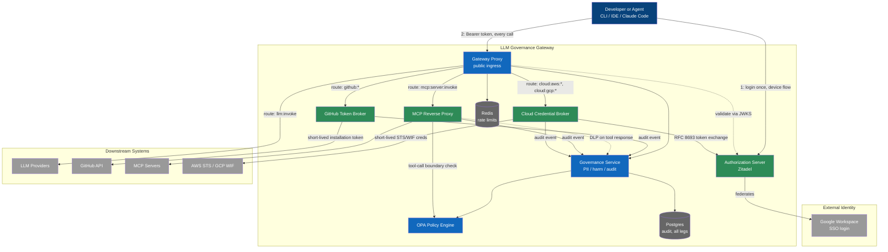
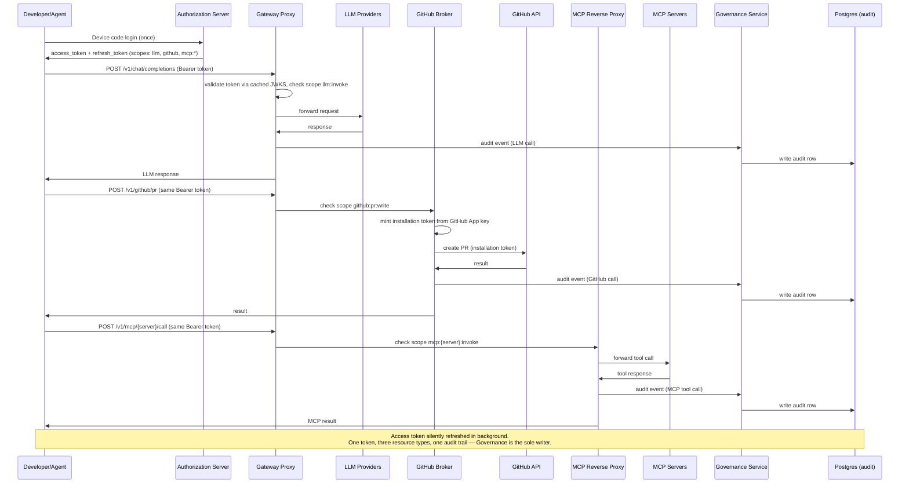
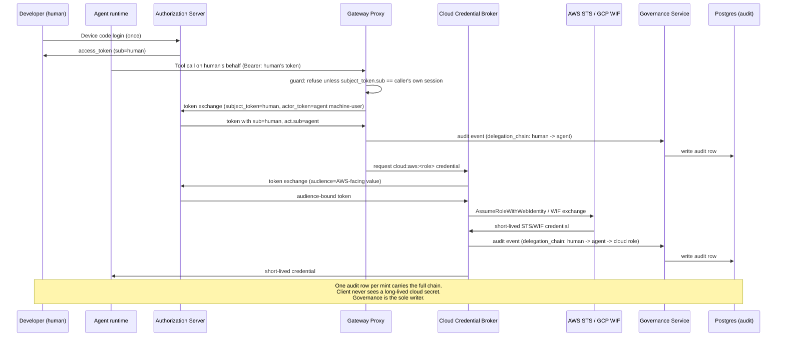

# Auth Architecture: Identity Broker + Gateway

## Shape of the system

One Authorization Server sits in front of everything and handles login exactly once, federating to Google Workspace for the actual credential check. It issues a single access token carrying multiple scopes (`llm:invoke`, `github:pr:write`, `mcp:<server>:invoke`). The existing Proxy stays the one ingress point for all traffic — it now validates that token instead of (or alongside) local JWT/API keys, then routes by path to one of four backends: the existing LLM dispatch, the GitHub Token Broker, the MCP Reverse Proxy, or the Cloud Credential Broker. All four legs emit audit events to the Governance Service, which is the sole writer to the audit table, so one query answers "what did this person/agent do" across every leg.

Nothing downstream (LLM providers, GitHub, MCP servers, AWS/GCP) ever sees a Google credential or a long-lived secret. They see short-lived, narrowly-scoped tokens the gateway mints or forwards.

## Container diagram



| Node | Type | Role |
|---|---|---|
| Developer or Agent | Person | CLI, IDE, Claude Code — any caller |
| Google Workspace | External | Actual login/credential check |
| Authorization Server | New | Device/PKCE flows, token issuance+refresh+revocation, multi-scope tokens, RFC 8693 token exchange |
| Gateway Proxy | Existing, extended | Public ingress, now validates AS tokens, routes by scope |
| Governance Service | Existing, extended | PII, harm, audit; sole writer to the audit table — the other three new components and the proxy send it audit events rather than writing Postgres directly; also the DLP checkpoint MCP Reverse Proxy calls on tool responses (reuses its existing Presidio endpoint — no second copy embedded) |
| OPA | Existing, extended | Policy decisions at ingress, and now also at the tool-call boundary inside MCP Reverse Proxy (tool + arguments + context, evaluated fresh every call) |
| GitHub Token Broker | New | Holds GitHub App key, mints 1hr installation tokens |
| MCP Reverse Proxy | New | Validates per-server/per-tool scope via OPA, forwards MCP JSON-RPC/SSE, DLP checkpoint on responses |
| Cloud Credential Broker | New | Server-side RFC 8693 exchange of the caller's token for short-lived AWS STS / GCP WIF credentials — proxy-mediated so the mint stays on the one audited path |
| Postgres | Existing, extended | Audit sink for all four legs; only Governance holds a DB edge and writes to it, six-dimension schema (see below) |
| Redis | Existing | Rate limiting — unchanged |

## Runtime flow



## What's new vs. what's reused

- **New:** Authorization Server (Zitadel instance in docker-compose), GitHub Token Broker, MCP Reverse Proxy, Cloud Credential Broker.
- **Extended:** Proxy's `authenticate()` gets an RS256/JWKS validation path against the AS, checked for scope per route. Governance gains an MCP-response DLP checkpoint. OPA gains a second evaluation point at the tool-call boundary. Audit schema gains delegation-chain/approval-status columns (six-dimension schema below).
- **Unchanged:** Rate limiting, provider dispatch.

---

## Design decisions from gap-analysis research

Two research passes — competitor/reference gap analysis, then deep dives on the questions it raised — were run against this design. Findings that change or firm up the shape above:

### Scope & entitlement model: coarse tokens, matrix lives outside Zitadel

Zitadel RBAC (project roles + org grants) is built for a small, human-managed role list, not N-servers × M-tools of scopes — minting one scope per server×tool doesn't fit the product and doesn't scale past a handful of MCP servers. Decision: Zitadel issues one coarse `mcp:invoke` scope plus a handful of project roles (`mcp-role:read-only`, `mcp-role:github-write`, ...) — small enough to satisfy the SOC2 access-review control below. The actual `mcp:<server>:<tool>` entitlement matrix lives **outside** Zitadel, as an OPA data document keyed by role, resolved at the MCP Reverse Proxy/OPA layer per call. Entitlement changes take effect immediately, no token reissuance. (Kong AI Gateway does the same thing with consumer-group ACLs — same shape, different vendor.)

### Policy enforcement: two evaluation points, one of them new

OPA now runs at two points: ingress (existing — can this token use this route/scope) and the **tool-call boundary**, newly added inside the MCP Reverse Proxy (tool + arguments + context, evaluated fresh on every call, no decision caching). Run it colocated (sidecar or in-process/WASM) in the MCP Reverse Proxy, not a remote hop — keeps overhead sub-millisecond to low-single-digit-ms. What's cacheable is the entitlement *data* (loaded as an OPA bundle once per session), not the *decision*. Input shape:

```json
{
  "principal": {"user_id": "user_01HXKP2M", "roles": ["mcp-role:github-write"]},
  "actor": {"agent_id": "agent_client_7f3n", "session_id": "sess_9xk2m7"},
  "tool": {"server": "github-mcp", "name": "create_pr", "arguments": {"repo": "...", "base": "main"}},
  "context": {"environment": "prod", "resource": "repo:org/name", "prior_calls_this_session": 4}
}
```

Log `model_refused` (the model declined on its own) and `policy_denied` (OPA blocked it) as structurally distinct audit event types — conflating them destroys the ability to reconstruct what actually stopped an action later.

### Agent identity, delegation, and cloud credentials — one RFC 8693 mechanism, two uses

Zitadel's native OAuth token exchange (RFC 8693) supports the `act` claim for real, not as a workaround: Gateway Proxy calls token exchange with `subject_token` = the caller's own session token and `actor_token` = one Zitadel machine-user per **agent type** (not per human), holding the `ORG_END_USER_IMPERSONATOR` role. Result token: `sub` = the human, `act.sub` = the agent — genuine "agent X acting for user Y," logged into the audit table's delegation-chain column.

**Caveat that has to be enforced by us, not Zitadel:** the impersonation role is coarse — an agent machine-user holding it can request an `act` token for *any* org user, and Zitadel's `resource` parameter isn't supported on this flow to narrow that. So the Gateway Proxy must refuse the exchange unless `subject_token`'s `sub` matches the session actually calling it. Zitadel does not enforce that binding for us.

The same RFC 8693 mechanism generalizes into the Cloud Credential Broker: exchange the Zitadel token server-side for AWS STS (`AssumeRoleWithWebIdentity`, IAM OIDC provider trusts Zitadel's issuer) or GCP Workload Identity Federation (no issuer allowlist — a self-hosted Zitadel is directly usable) credentials. **Proxy-mediated, not client-direct** — a client-direct path (client calls Zitadel then AWS/GCP itself) would create a second, unaudited credential-mint path and break the one-audit-table goal. One audit row per mint carries the full chain: human → agent → cloud role.

### DLP on MCP tool responses

Checkpoint sits after the downstream MCP server's response is received and before it's forwarded to the client — same hop as the spec-mandated audience/schema checks. Call the Governance service's **existing** Presidio HTTP endpoint on the serialized response body (don't re-embed the library or load a second copy of the NLP models in the MCP Reverse Proxy), then block/alert or anonymize before forwarding. Presidio has no streaming API, so buffer the full response body — same approach the reference implementation (Strac) uses. **Gap flagged, not solved:** Presidio is text-only; binary/OCR tool responses (images, attachments) have no coverage without a separate OCR pre-pass. Scoped out of the POC unless a specific target MCP server is known to return binary payloads.

### Break-glass path for when OPA is down

1. **Bypass only the OPA call, never the auth stack.** Zitadel is a different failure domain and stays the trust anchor — never fall back to "no auth" because OPA is unreachable.
2. **Pre-provisioned, not self-service:** a small named set of admin identities carry a distinct `breakglass:emergency-access` scope, granted out-of-band in advance — never mintable at request time.
3. **Triggers on unreachability, never on DENY.** The fail-closed branch keys off a circuit-breaker/health-check failure to OPA (timeout/connection refused), never off OPA returning a policy deny — conflating those two signals turns break-glass into a policy bypass.
4. **Compensating controls:** mandatory step-up MFA re-auth at time of use, short automatic TTL (single request or ~15 min), synchronous alert fired the instant the path is invoked, a distinct `is_breakglass=true` audit event type, forced automatic expiry.
5. Second-admin approval (the gap between "acceptable POC" and "production-grade") is deferred — see open questions below.

### Audit table: adopt the six-dimension schema now

Postgres audit is the one piece of infrastructure that's a gap-multiplier across every leg above — decisions made here are cheap now, before four independent legs (LLM dispatch, GitHub Broker, MCP Reverse Proxy, Cloud Credential Broker) are all generating audit events, and expensive after. Adopt the schema now. The six dimensions: user identity, agent identity, authorization scope, action (tool + arguments + result), delegation chain, approval status — `session_id` is a correlation key and `event_type` a classification tag, not one of the six:

```json
{
  "session_id": "sess_9xk2m7",
  "user": {"id": "user_01HXKP2M"},
  "agent": {"id": "agent_client_7f3n"},
  "authorization": {"scopes": ["documents:read"]},
  "action": {"tool": "read_document", "arguments": {"document_id": "doc_88pk3r"}, "result": "..."},
  "delegation_chain": [{"actor": "user_01HXKP2M", "role": "initiator"}, {"actor": "agent_client_7f3n", "role": "delegate"}],
  "approval_status": "granted",
  "event_type": "tool_invoked"
}
```

Also cheap now / expensive later: restrict UPDATE/DELETE grants on the audit table (SOC2 tamper-evidence, one GRANT statement); log denials as well as grants; `is_breakglass` and `policy_denied` vs `model_refused` as distinct `event_type` values; adopt OTel GenAI span naming (`gen_ai.operation.name`, `execute_tool`) for field vocabulary instead of inventing bespoke names; decide retention/hot-cold tiering now even before a cold tier exists (12-month minimum baseline, 90-day-hot is typical).

**Write-access model: Governance only, no exceptions.** Only the Governance Service holds a database credential and issues `INSERT`s against `audit_log`; this matches what's already built — `governance/app/audit.py` is the only code that writes the table today, the proxy's existing audit routes are read-only proxies to Governance over HTTP, and every service currently shares one Postgres role with no per-service credential story to draw on. The GitHub Token Broker, MCP Reverse Proxy, and Cloud Credential Broker do not get a `pg` edge or a database credential of their own — each sends its audit facts to Governance (an internal, `X-Internal-Token`-authenticated write endpoint, same auth pattern the proxy's existing read routes use) and Governance performs the insert. This is a deliberate choice, not an oversight: adding three more network-reachable principals with direct write access to a tamper-evidence-relevant table would multiply risk for no stated benefit, and it reuses the append-only enforcement already migrated in `001_initial_schema.py` — the `gateway_app` role's `INSERT`-only grant (`UPDATE`/`DELETE`/`TRUNCATE` revoked), forced RLS, and the `deny_audit_mutation` trigger — instead of designing new per-broker credential scoping from scratch. If a future requirement (e.g. audit writes must survive a Governance outage) forces brokers to write independently, that needs its own credential-provisioning design as a separate follow-up, not a quiet exception carved into this model.

### Package registry publishing: not directly brokerable

npm/PyPI/crates.io trusted-publishing all allowlist CI-vendor OIDC issuers only (GitHub Actions, GitLab, and/or CircleCI/Google Cloud/ActiveState depending on registry) — a self-hosted Zitadel issuer cannot be registered on any of the three. This is a hard product limitation on the registry side, not a config gap we can close. If "publish this package" needs to be a first-class gateway-mediated action, the real shape is two-hop: **Gateway → GitHub Token Broker → `workflow_dispatch` → GitHub Actions' own native OIDC → registry.** The Gateway authorizes and triggers; it never touches a registry credential. The audit trail necessarily spans two systems (our table for the trigger, GitHub Actions' own run log for the actual publish) unless Actions run results are ingested back — flagged as an open question, not solved here.

## Delegation & cloud credential flow



## Open questions / deferred past POC

- **Second-admin approval for break-glass access** — real gap between acceptable-for-POC and production-grade; flagged explicitly rather than silently skipped.
- **Binary/OCR coverage for DLP on MCP tool responses** — Presidio is text-only; no coverage plan yet for image/attachment-returning tools.
- **Newly-provisioned agent → human binding** — this design assumes the human already holds a token; no flow yet for how a *new* agent proves it's acting for a specific human (WorkOS's agent-verified vs. user-claimed pattern is the reference).
- **Budget/spend caps as a distinct mechanism from Redis rate limiting** — nested org→team→user→key hierarchy (LiteLLM/Portkey pattern); not designed yet.
- **Live session/token revocation (kill-switch)** — current design relies on TTL expiry; no instant-kill path for a compromised or misbehaving session.
- **Tool schema pinning/diffing in the MCP Reverse Proxy** — the concrete defense against rug-pull attacks (a tool silently redefining itself post-approval); not yet designed.
- **Ingesting GitHub Actions run results back into the audit table** — needed to close the two-hop publish-audit gap described above.
- **WORM storage / full SIEM integration / ISO 27001 3-year retention** — reasonable to defer past POC per the compliance research; noted so it isn't forgotten.
