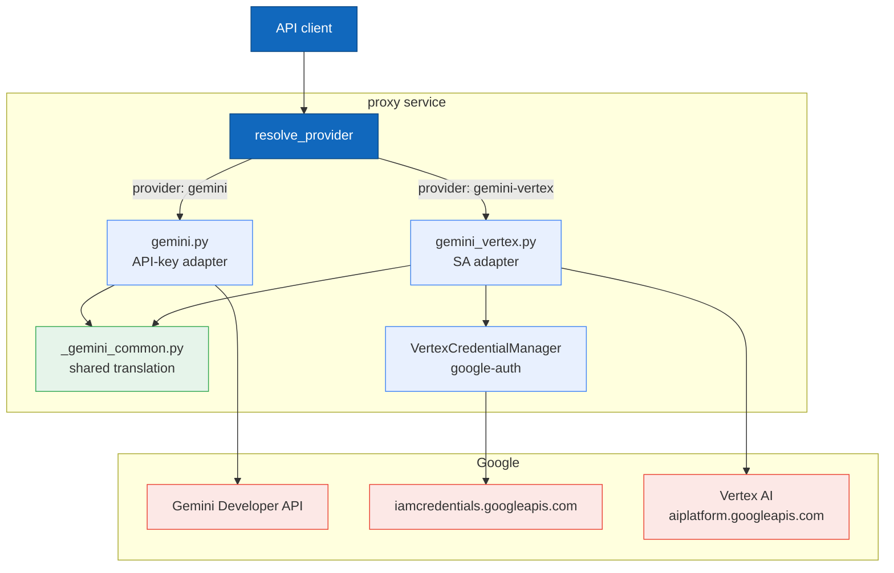
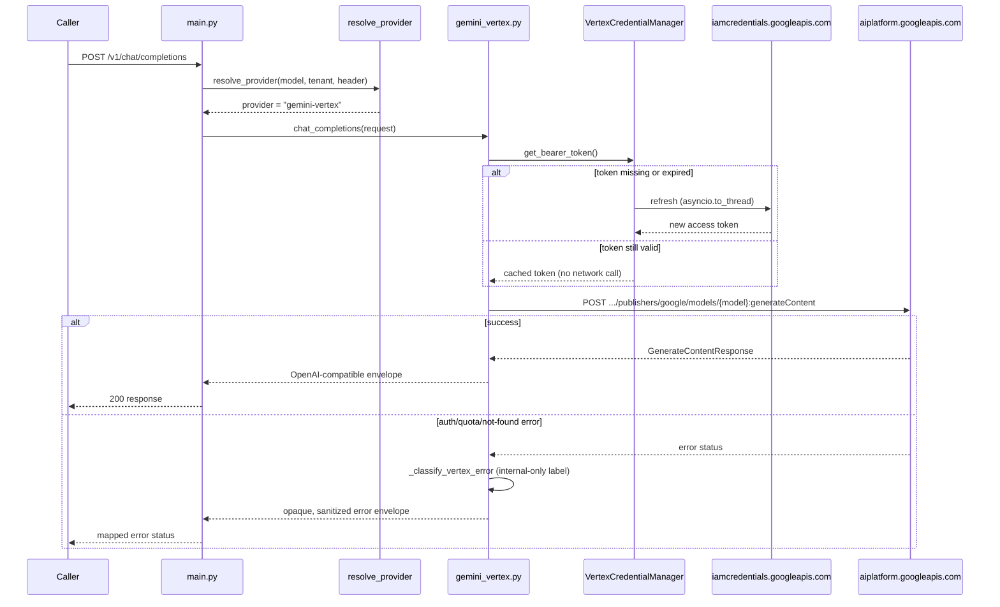

# Vertex AI Gemini adapter (SA-authenticated path)

Status: accepted and implemented for `ai-gateway-76iq`.

## Decision

Add a second Gemini adapter backed by Google Vertex AI (`aiplatform.googleapis.com`), authenticated with an impersonated GCP service account, alongside the existing API-key-based Gemini Developer API adapter. Neither adapter replaces the other — callers choose per request/tenant which path to use. See [PRD](prd-gemini-vertex-adapter.md) and [technical spec](spec-gemini-vertex-adapter.md) for the full design record; this document describes what actually landed.

## Why a second Gemini path

| Concern | Gemini Developer API (`gemini`) | Vertex AI (`gemini-vertex`) |
|---|---|---|
| Auth | Static `GEMINI_API_KEY` | Impersonated GCP service-account bearer token (ADC) |
| Endpoint | `generativelanguage.googleapis.com` | `{location}-aiplatform.googleapis.com` (or global) |
| Model addressing | Model name in request body | Model addressed only via the URL path |
| Fits | API-key-only environments, quick setup | Environments already using GCP IAM/VPC-SC/org policy for LLM governance |

Both paths share one translation core so behavior stays consistent and the two adapters don't drift independently.

## Runtime contract



| Node | Description |
|---|---|
| `resolve_provider` | Routing function (`proxy/app/routing.py`); header override → exact `models.yaml` id match → prefix inference → tenant default → not found |
| `gemini.py` | Existing API-key adapter; unmodified external behavior, calls into `_gemini_common.py` with `DEVELOPER_API_DIALECT` |
| `gemini_vertex.py` | Vertex adapter; builds the Vertex resource path, attaches a bearer token, calls into `_gemini_common.py` with `VERTEX_DIALECT` |
| `_gemini_common.py` | Shared, dialect-parameterized request/response translation used by both adapters |
| `VertexCredentialManager` | Loads `google.auth.default()` once per process, caches the credential object, refreshes off the event loop via `asyncio.to_thread` |
| `iamcredentials.googleapis.com` | Mints the short-lived impersonated access token behind ADC |
| `aiplatform.googleapis.com` | Vertex AI `generateContent`/`streamGenerateContent` endpoint |

### Selection mechanism

`resolve_provider()` (`proxy/app/routing.py`) picks between the two paths using its existing precedence chain, unchanged in order, with `gemini-vertex` recognized as a provider value throughout:

1. **Header override** — a caller sending `x-gateway-provider: gemini-vertex` gets routed there only if they hold the `gateway:provider_override:gemini-vertex` role. Without it, the request is **hard-denied** (`("", "override_denied")`) — this is not a silent fallback to the catalog/tenant default.
2. **Exact `models.yaml` id match** — the catalog entry `gemini-3.1-flash-lite-vertex` has `provider: gemini-vertex`.
3. **Prefix inference** — a bare `gemini-*` model id normally maps to `gemini` (`_PREFIX_MAP`), but if the *tenant's* `default_provider` is `gemini-vertex`, the same bare id resolves to `gemini-vertex` instead. A model id alone never implies Vertex; the tenant default has to say so.
4. **Tenant default** — used when the model id matches no catalog entry and no prefix.

`gemini-vertex` is a validated-accepted value for `config/tenants.yaml`'s `default_provider` field, alongside `gemini`. No seed tenant sets it by default today; it is exercised in tests (`tests/test_provision.py::test_load_config_accepts_gemini_vertex_default_provider`).

### Sequence: Vertex path request with credential refresh



Streaming (`chat_completions_stream`) follows the same shape against `streamGenerateContent?alt=sse` instead of `generateContent`, yielding OpenAI-style `chat.completion.chunk` SSE frames. Pre-stream failures (bad request, auth, non-200 before any bytes arrive) raise the same error path as non-streaming; a mid-stream failure yields one SSE-embedded error frame and ends the stream without `[DONE]`.

### Shared translation core, and the one dialect wrinkle

`proxy/app/providers/_gemini_common.py` holds everything that is identical, or parameterizable by a small `GeminiDialect`, between the two backends: message/tool/generation-config translation, candidate-to-OpenAI-choice translation, usage-metadata translation, and the `BLOCK_REASON_UNSPECIFIED` vs. `BLOCKED_REASON_UNSPECIFIED` sentinel-spelling difference. `DEVELOPER_API_DIALECT` and `VERTEX_DIALECT` differ mainly in `extra_finish_reasons` — backend-legitimate `finishReason` values the *other* backend doesn't define, and therefore shouldn't raise on.

One non-obvious wrinkle: `gemini.py`'s response-translation call site does **not** pass `DEVELOPER_API_DIALECT` directly. It defines a stricter local dialect,

```python
_RESPONSE_DIALECT = replace(DEVELOPER_API_DIALECT, extra_finish_reasons=frozenset())
```

and uses that instead. `DEVELOPER_API_DIALECT.extra_finish_reasons` is real (used correctly elsewhere, e.g. by `provider_capabilities.py`) but if passed straight into `translate_candidate_to_openai_choice`, those finish reasons (`LANGUAGE`, `TOO_MANY_TOOL_CALLS`, etc.) would silently map to `finish_reason: "content_filter"` instead of raising `GeminiTranslationError`, which is the pre-existing, tested Developer-API behavior. Request-translation dialect and response-translation dialect are therefore not always the same dialect object for a given backend — a detail worth knowing before extending either adapter.

### Naming fix

`config/models.yaml` previously had `provider: google` for the Gemini Developer API catalog entry, inconsistent with the `"gemini"` key used everywhere else (`routing.py`, `provider_capabilities.py`). This is fixed — the entry now reads `provider: gemini` — and `main.py`'s compensating shim (`capability_provider = "gemini" if provider == "google" else provider`) is removed. `capability_provider` and `provider` are now always the same value for both Gemini paths.

## Configuration

| Variable | Required | Meaning |
|---|---:|---|
| `GEMINI_VERTEX_PROJECT_ID` | for Vertex path | GCP project id; `gemini_vertex_client` is only constructed at startup if this is set, so deployments that don't configure Vertex skip credential loading entirely |
| `GEMINI_VERTEX_LOCATION` | for Vertex path | Vertex region, e.g. `us-central1`, or `global`; no built-in default in `Settings` — `.envrc.example` sets `us-central1` as the suggested local-dev value, but leaving it unset while `GEMINI_VERTEX_PROJECT_ID` is set produces a malformed base URL (`https://-aiplatform.googleapis.com`), not a startup error |
| `GEMINI_VERTEX_CREDENTIALS_PATH` | no | Optional explicit path to an impersonated-ADC JSON file; falls back to standard ADC discovery (`GOOGLE_APPLICATION_CREDENTIALS` or the gcloud ADC file) if unset |
| `GEMINI_VERTEX_EXPECTED_SERVICE_ACCOUNT` | local impersonation | Effective service-account identity expected, mirroring the DLP integration's preflight pattern |
| `GEMINI_VERTEX_TIMEOUT_SECONDS` | no | Per-request HTTP timeout; default `60` |

These are a distinct env-var prefix from governance's `GOOGLE_DLP_*` settings on purpose: the proxy's Vertex AI access is configured independently of governance's DLP credential sentinel, even when both happen to point at the same GCP project. See `.envrc.example` for the full block and defaults.

## GCP / ADC setup

Use service-account impersonation, exactly as for the [Google Sensitive Data Protection PII backend](google-sensitive-data-protection.md) — this adapter never reads or accepts a raw service-account key file. The underlying mechanics are the same `google-auth` ADC flow, just a different scope (`https://www.googleapis.com/auth/cloud-platform`) and a different settings prefix (`GEMINI_VERTEX_*` instead of `GOOGLE_DLP_*`).

- **Local development**: set `GEMINI_VERTEX_EXPECTED_SERVICE_ACCOUNT` and create impersonated ADC the same way the DLP doc's "Local ADC" section describes (`make google-adc-login`, `make google-adc-preflight`), pointed at the service account this adapter should impersonate. `GEMINI_VERTEX_CREDENTIALS_PATH` can point at that ADC file explicitly, or be left unset to use standard ADC discovery.
- **Production**: use the platform's attached service account or Workload Identity Federation so ADC obtains short-lived credentials automatically. Do not create, mount, or check in a long-lived service-account key file for this adapter, ever.
- **IAM**: the impersonated service account needs Vertex AI access (e.g. `roles/aiplatform.user`) on the target project, and the source identity doing the impersonating needs `roles/iam.serviceAccountTokenCreator` on that exact service account — the same shape as the DLP integration's IAM setup, substituting the Vertex AI role for `roles/dlp.user`.

`VertexCredentialManager` loads `google.auth.default()` once per process (not per request), caches the credential object, and refreshes it off the event loop via `asyncio.to_thread` only when `google-auth`'s own `.valid`/`.expired` properties say it's needed.

## Flagged risks (open, verify before production traffic)

These are carried over from the spec's ["Open Risks Carried Into Implementation"](spec-gemini-vertex-adapter.md#open-risks-carried-into-implementation) section. Neither blocked this epic's implementation; both are still open today — they were not resolved by a live Vertex smoke test during implementation, despite the spec's Phase 4/5 language anticipating that verification would happen.

1. **`alt=sse` streaming response framing.** `chat_completions_stream()` assumes Vertex's `streamGenerateContent?alt=sse` framing is one JSON `GenerateContentResponse` per `data:` line, identical to the Gemini Developer API's already-production-tested framing. This is a high-confidence inference from convergent secondary sources, not a canonical Google doc citation, and the code's own docstring flags it as such. **Verify with a live smoke test against a real Vertex AI streaming endpoint before exposing this path to production traffic.**
2. **Exact 403 `reason` string for a missing IAM role grant.** `_classify_vertex_error()` splits 403s into two cases. The *impersonation-denied* case (source identity can't mint an impersonated token — fails at `iamcredentials.googleapis.com` before Vertex is ever reached) is confirmed against a real observed error body, matching on `iam.googleapis.com`/`getaccesstoken`/`impersonat` in the response body. The *other* 403 case — an impersonated service account that successfully obtains a token but lacks `roles/aiplatform.user` (or equivalent) on Vertex AI itself — falls through to a generic `vertex_iam_permission_denied` label. That fallback's exact `reason` string has not been confirmed against a real failure. **Verify the real string before tightening the classification**, if finer-grained handling of that case is ever needed.

Both labels are internal-only, for logging; the caller-facing error response stays opaque via the existing `sanitize_upstream_error()` policy regardless of which branch fires.

## Non-goals

- **No PHI/BAA support.** Neither Gemini path is on the `phi_approved_providers` allowlist (`policies/llm/authz.rego`, currently `{"azure-openai", "bedrock"}`). PHI-flagged requests are denied for `gemini` and `gemini-vertex` alike; adding either would require a signed BAA with Google and a separate policy change.
- **No new external API endpoints.** Existing `/v1/chat/completions` (and other existing Gemini-capable routes) gained a second internal dispatch path; the public API surface is unchanged.
- **No `google-genai` SDK runtime dependency.** This adapter is a hand-rolled `httpx`-based HTTP client, consistent with the other provider modules in `proxy/app/providers/`. Only `google-auth[requests]` was added as a runtime dependency; `google-genai` remains a dev-only, unchanged pin.
