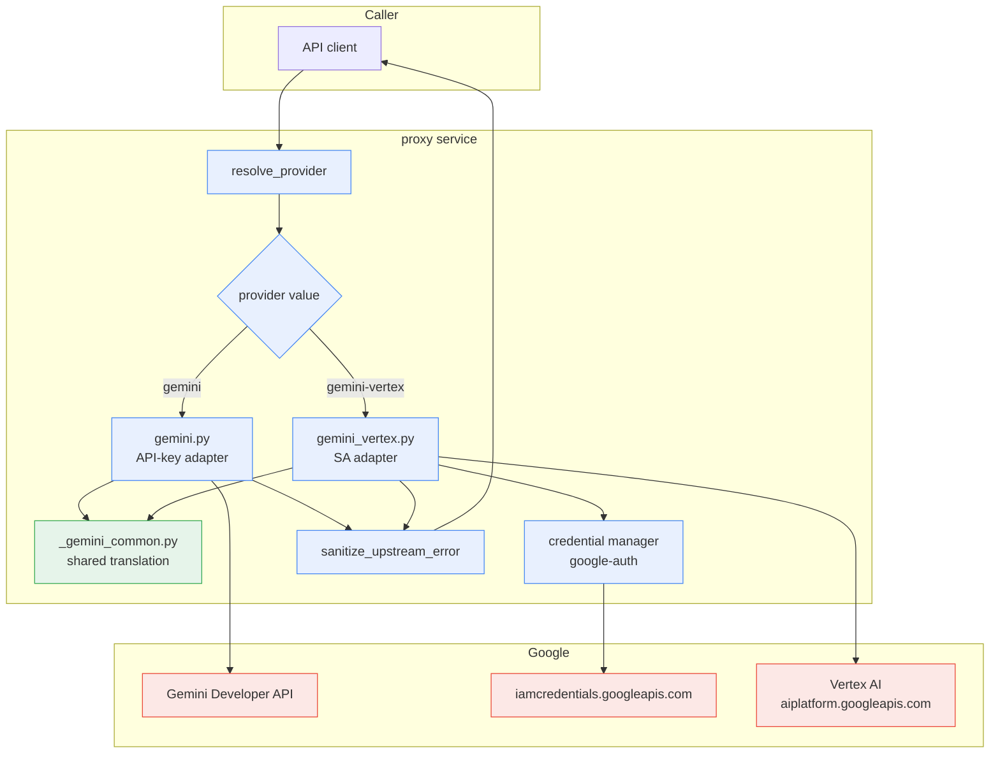
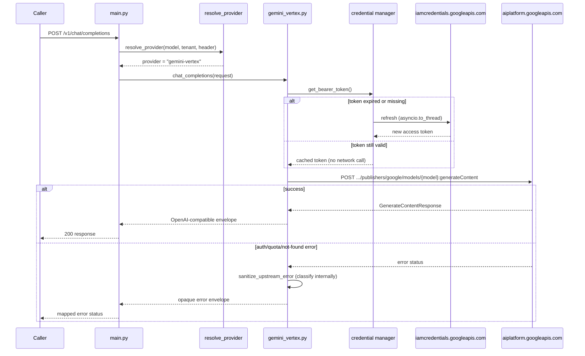

# Technical Specification: Vertex AI Gemini Adapter (SA-authenticated, dual-path)

**Status:** Approved
**Author:** Claude (epic-planner agent)
**Created:** 2026-08-08
**PRD:** [docs/prd-gemini-vertex-adapter.md](./prd-gemini-vertex-adapter.md)
**Beads Epic:** ai-gateway-76iq

---

## Architecture Overview

Two Gemini adapters live side by side in the proxy. Both call the same shared translation core. Provider selection happens before either adapter runs, using the existing `resolve_provider()` precedence chain plus one new provider value.



**Legend**

| Node | Description |
|---|---|
| `resolve_provider` | Existing routing function (`proxy/app/routing.py`); extended with the `gemini-vertex` provider value |
| `gemini.py` | Existing adapter, unmodified external behavior, refactored internally to call `_gemini_common.py` |
| `gemini_vertex.py` | New adapter; builds Vertex resource path, attaches Bearer token, calls shared translation |
| `_gemini_common.py` | New shared module; body-shape translation parameterized by a per-backend dialect |
| credential manager | `google.auth.default()` + cached credential object + `asyncio.to_thread`-wrapped refresh |
| `sanitize_upstream_error` | Existing error module (`proxy/app/providers/errors.py`), extended with Vertex-specific internal classification |

### Runtime sequence: Vertex path request with credential refresh



---

## Database Schema

Not applicable. This feature adds no persistent storage, no new tables, and no migrations. Credentials are held in-process (cached credential object) and are never written to disk or a database by the gateway itself; ADC discovery reads the existing `GOOGLE_APPLICATION_CREDENTIALS`-style file already used by the DLP integration, or standard ADC discovery if unset.

## API Endpoints

No new external endpoints. Existing `/v1/chat/completions` (and any other existing Gemini-capable routes in `proxy/app/main.py`) gain a second internal path, selected by provider resolution. No public API surface changes.

---

## Service Layer

### 1. `proxy/app/providers/_gemini_common.py` (new)

Shared translation core used by both `gemini.py` and `gemini_vertex.py`. Holds everything that is identical, or near-identical modulo a small dialect difference, between the Developer API and Vertex AI request/response bodies.

```python
"""Shared Gemini request/response translation core.

Used by both proxy/app/providers/gemini.py (API-key, Developer API) and
proxy/app/providers/gemini_vertex.py (SA-authenticated, Vertex AI).

Only the fields/behaviors that are identical (or trivially parameterizable)
across both backends live here. Backend-specific divergences (see
docs/spec-gemini-vertex-adapter.md, "Body-shape divergences") stay in each
adapter module.
"""
from dataclasses import dataclass, field
from typing import Any


@dataclass(frozen=True)
class GeminiDialect:
    """Per-backend knobs for the shared translation functions."""

    name: str  # "gemini" or "gemini-vertex"
    include_model_in_body: bool  # True for Developer API, False for Vertex
    block_reason_unset: str  # "BLOCK_REASON_UNSPECIFIED" | "BLOCKED_REASON_UNSPECIFIED"
    extra_finish_reasons: frozenset[str] = field(default_factory=frozenset)
    # Vertex-only: {"MODEL_ARMOR"}
    # Developer-API-only: {"LANGUAGE", "TOO_MANY_TOOL_CALLS",
    #                       "MISSING_THOUGHT_SIGNATURE", "MALFORMED_RESPONSE",
    #                       "ESCALATION"}


DEVELOPER_API_DIALECT = GeminiDialect(
    name="gemini",
    include_model_in_body=True,
    block_reason_unset="BLOCK_REASON_UNSPECIFIED",
    extra_finish_reasons=frozenset(
        {"LANGUAGE", "TOO_MANY_TOOL_CALLS", "MISSING_THOUGHT_SIGNATURE",
         "MALFORMED_RESPONSE", "ESCALATION"}
    ),
)

VERTEX_DIALECT = GeminiDialect(
    name="gemini-vertex",
    include_model_in_body=False,
    block_reason_unset="BLOCKED_REASON_UNSPECIFIED",
    extra_finish_reasons=frozenset({"MODEL_ARMOR"}),
)

# HarmCategory values present on BOTH backends. Adapters may pass through
# additional backend-specific categories, but only these four are asserted
# in shared contract tests.
SHARED_HARM_CATEGORIES = frozenset(
    {"HARM_CATEGORY_HATE_SPEECH", "HARM_CATEGORY_DANGEROUS_CONTENT",
     "HARM_CATEGORY_HARASSMENT", "HARM_CATEGORY_SEXUALLY_EXPLICIT"}
)


def translate_openai_messages_to_contents(messages: list[dict]) -> list[dict]:
    """OpenAI-style messages -> Gemini `contents` (Content/Part list).

    Identical shape on both backends. Existing logic in gemini.py's current
    message-mapping code moves here verbatim.
    """
    ...


def translate_generation_config(openai_request: dict) -> dict:
    """OpenAI sampling params -> Gemini `generationConfig`.

    Identical field names on both backends (temperature, topP, topK,
    maxOutputTokens, stopSequences, candidateCount, etc.).
    """
    ...


def translate_tools(openai_tools: list[dict] | None) -> list[dict] | None:
    """OpenAI `tools`/function-calling -> Gemini `tools`/`toolConfig`.

    Identical shape on both backends.
    """
    ...


def translate_candidate_to_openai_choice(
    candidate: dict, dialect: GeminiDialect, index: int
) -> dict:
    """Gemini `candidates[i]` -> OpenAI `choices[i]`.

    Uses dialect.extra_finish_reasons only to avoid raising on a
    backend-legitimate finishReason value the other backend doesn't define;
    the OpenAI-facing finish_reason mapping itself is shared.
    """
    ...


def translate_usage_metadata(usage_metadata: dict) -> dict:
    """Gemini `usageMetadata` -> OpenAI `usage`.

    Field names (promptTokenCount, candidatesTokenCount, totalTokenCount)
    are identical on both backends; directly reusable with no dialect
    parameter needed.
    """
    ...


def is_block_reason_unset(block_reason: str | None, dialect: GeminiDialect) -> bool:
    """Handles the BLOCK_REASON_UNSPECIFIED vs BLOCKED_REASON_UNSPECIFIED
    sentinel spelling difference between the two backends."""
    return block_reason is None or block_reason == dialect.block_reason_unset
```

### 2. `proxy/app/providers/gemini_vertex.py` (new)

```python
"""Vertex AI-backed Gemini adapter, authenticated via impersonated GCP
service account (never a raw SA key file).

Mirrors the external call shape of proxy/app/providers/gemini.py so
main.py's dispatch code treats both adapters uniformly.
"""
import asyncio
import time

import google.auth
import google.auth.transport.requests
import httpx

from app.config import Settings
from app.providers._gemini_common import (
    VERTEX_DIALECT,
    translate_candidate_to_openai_choice,
    translate_generation_config,
    translate_openai_messages_to_contents,
    translate_tools,
    translate_usage_metadata,
)
from app.providers.errors import sanitize_upstream_error

_CLOUD_PLATFORM_SCOPE = "https://www.googleapis.com/auth/cloud-platform"


class VertexCredentialManager:
    """Loads and caches an impersonated-ADC credential; refreshes off the
    event loop. Constructed once per client (process lifetime), not per
    request.
    """

    def __init__(self, credentials_path: str | None) -> None:
        self._credentials_path = credentials_path
        self._credentials = None  # google.auth.credentials.Credentials
        self._project_id: str | None = None
        self._lock = asyncio.Lock()

    def _load_sync(self) -> None:
        # google.auth.default() auto-detects impersonated-service-account
        # ADC JSON when GOOGLE_APPLICATION_CREDENTIALS (or the equivalent
        # gcloud ADC file) points at one. Raises google.auth.exceptions
        # .DefaultCredentialsError if no valid ADC is found.
        credentials, project_id = google.auth.default(
            scopes=[_CLOUD_PLATFORM_SCOPE]
        )
        self._credentials = credentials
        self._project_id = project_id

    async def get_bearer_token(self) -> str:
        async with self._lock:
            if self._credentials is None:
                await asyncio.to_thread(self._load_sync)
            if not self._credentials.valid:
                # credentials.refresh() is a blocking network call
                # (issues a token request to iamcredentials.googleapis.com
                # for impersonated SAs). google-auth's own .valid/.expired
                # properties already build in a ~3m45s refresh margin, so
                # this only fires when genuinely needed.
                request = google.auth.transport.requests.Request()
                await asyncio.to_thread(self._credentials.refresh, request)
            return self._credentials.token


def _vertex_base_url(settings: Settings) -> str:
    location = settings.gemini_vertex_location
    if location == "global":
        return "https://aiplatform.googleapis.com"
    return f"https://{location}-aiplatform.googleapis.com"


def _vertex_model_path(settings: Settings, model: str) -> str:
    return (
        f"projects/{settings.gemini_vertex_project_id}"
        f"/locations/{settings.gemini_vertex_location}"
        f"/publishers/google/models/{model}"
    )


class VertexGeminiClient:
    def __init__(self, settings: Settings) -> None:
        self._settings = settings
        self._creds = VertexCredentialManager(
            settings.gemini_vertex_credentials_path
        )
        self._http = httpx.AsyncClient(timeout=settings.gemini_vertex_timeout_seconds)

    async def chat_completions(self, openai_request: dict) -> dict:
        model = openai_request["model"]
        token = await self._creds.get_bearer_token()
        base_url = _vertex_base_url(self._settings)
        model_path = _vertex_model_path(self._settings, model)
        url = f"{base_url}/v1/{model_path}:generateContent"

        body = {
            # NOTE: no "model" field -- Vertex addresses the model via the
            # URL path only (VERTEX_DIALECT.include_model_in_body is False).
            "contents": translate_openai_messages_to_contents(
                openai_request["messages"]
            ),
            "generationConfig": translate_generation_config(openai_request),
        }
        tools = translate_tools(openai_request.get("tools"))
        if tools is not None:
            body["tools"] = tools

        try:
            resp = await self._http.post(
                url,
                json=body,
                headers={"Authorization": f"Bearer {token}"},
            )
            resp.raise_for_status()
        except httpx.HTTPStatusError as exc:
            raise sanitize_upstream_error(
                exc, provider="gemini-vertex", classify=_classify_vertex_error
            ) from exc

        data = resp.json()
        return _to_openai_envelope(data, model)

    async def chat_completions_stream(self, openai_request: dict):
        # alt=sse streaming path. FLAGGED RISK: exact SSE framing not
        # directly confirmed against a canonical Google doc during
        # research (high-confidence inference from convergent third-party
        # sources only). Verify against a live Vertex endpoint before
        # shipping; do not assume byte-for-byte parity with the Developer
        # API's streaming framing.
        ...


def _classify_vertex_error(status_code: int, body: dict) -> str:
    """Internal-only classification label for logging; caller-facing
    response stays opaque via the existing sanitize_upstream_error policy.
    """
    if status_code == 401:
        return "vertex_token_expired"
    if status_code == 403:
        # Two distinct causes with different remediation paths:
        #  - impersonation grant missing: raised by
        #    iamcredentials.googleapis.com before Vertex is ever reached.
        #  - impersonated SA lacks roles/aiplatform.user (or equivalent):
        #    raised by aiplatform.googleapis.com.
        # FLAGGED RISK: the exact `reason` string for the second case was
        # inferred by analogy during research, not directly confirmed.
        # Verify the real reason string during implementation before
        # hardcoding a match on it.
        message = str(body).lower()
        if "iamcredentials" in message or "impersonat" in message:
            return "vertex_impersonation_denied"
        return "vertex_iam_permission_denied"
    if status_code == 404:
        return "vertex_model_or_region_unavailable"
    if status_code == 429:
        return "vertex_quota_exceeded"
    return "vertex_unknown_error"


def _to_openai_envelope(data: dict, model: str) -> dict:
    ...


def make_client(settings: Settings) -> VertexGeminiClient:
    return VertexGeminiClient(settings)
```

### 3. `proxy/app/providers/gemini.py` (existing, refactored)

No external behavior change. Internally, the message/generation-config/tools/candidate/usage translation calls move to `_gemini_common.py`, called with `DEVELOPER_API_DIALECT`. This is a refactor task, not a rewrite — existing tests in `test_adapters.py` and `test_official_sdk_contracts.py` must continue passing unmodified as a regression check.

### 4. `proxy/app/routing.py` (modified)

`resolve_provider()`'s existing precedence order is unchanged: header override → exact model match in `models.yaml` → prefix inference → tenant default → not-found. Add `"gemini-vertex"` as a recognized provider value throughout (wherever `"gemini"` is currently enumerated as a valid provider constant/literal). Prefix inference (`_PREFIX_MAP`) continues to map bare `gemini-*` model-id prefixes to whichever provider a tenant's `default_provider` specifies (`gemini` or `gemini-vertex`); a model id alone does not imply Vertex unless the tenant default or an explicit catalog entry says so.

### 5. `proxy/app/provider_capabilities.py` (modified)

Add a `PROVIDER_CAPABILITIES["gemini-vertex"]` entry, derived from the existing `"gemini"` entry, adjusted using `GeminiDialect.extra_finish_reasons` and the Vertex-only/Developer-API-only field lists from `stage-1-research.md`/`deep-research.md` §2, so `unsupported_chat_fields()` reports correctly for the Vertex path (e.g. Vertex does not support Developer-API-only `finishReason` values as request-time flags; this is a response-shape concern, not a request-capability concern, but is documented in the same table for completeness).

### 6. `proxy/app/main.py` (modified)

- Remove line 486's shim: `capability_provider = "gemini" if provider == "google" else provider`. After `config/models.yaml`'s `provider: google` → `provider: gemini` fix, `provider` and `capability_provider` are always identical for the Gemini Developer API path, so the shim becomes dead code.
- Add client construction for the Vertex path in the existing lifespan/startup client-construction block, alongside the existing `gemini.make_client(settings)` call: `gemini_vertex.make_client(settings)`, gated on `settings.gemini_vertex_project_id` being set (so deployments that don't configure Vertex don't attempt credential loading at startup).
- Extend the existing dispatch logic (wherever `provider == "gemini"` currently selects the Gemini client, around the `chat_completions` call site) to also handle `provider == "gemini-vertex"`, selecting the Vertex client instead.

---

## Configuration

### New `Settings` fields (`proxy/app/config.py`)

```python
class Settings(BaseSettings):
    ...
    # Existing field, unchanged:
    gemini_api_key: str = ""

    # New: Vertex AI (SA-authenticated) path. Prefixed distinctly from
    # governance's GOOGLE_DLP_* settings even though the underlying GCP
    # project id may coincide (both services configure Google Cloud
    # access independently).
    gemini_vertex_project_id: str = ""
    gemini_vertex_location: str = ""  # e.g. "us-central1", or "global"
    gemini_vertex_credentials_path: str = ""  # optional; falls back to
        # standard ADC discovery (GOOGLE_APPLICATION_CREDENTIALS or
        # gcloud ADC file) if unset
    gemini_vertex_expected_service_account: str = ""  # for startup
        # validation, mirroring scripts/google_adc_keychain.py's
        # --expected-service-account pattern
    gemini_vertex_timeout_seconds: float = 60.0
```

### New env vars (`.envrc.example` additions)

```bash
# --- Vertex AI Gemini adapter (SA-authenticated path) ---
# Distinct prefix from GOOGLE_DLP_* on purpose: this configures the
# proxy service's Vertex AI access, independently of governance's DLP
# credential-sentinel setup, even when pointed at the same GCP project.
export GEMINI_VERTEX_PROJECT_ID=""
export GEMINI_VERTEX_LOCATION="us-central1"   # or "global"
export GEMINI_VERTEX_CREDENTIALS_PATH=""       # optional; ADC auto-discovery if unset
export GEMINI_VERTEX_EXPECTED_SERVICE_ACCOUNT=""
export GEMINI_VERTEX_TIMEOUT_SECONDS="60"
```

### `config/models.yaml` changes

```yaml
# Before (bug):
- id: gemini-1.5-pro
  provider: google   # <-- inconsistent with routing.py/provider_capabilities.py

# After (fix):
- id: gemini-1.5-pro
  provider: gemini

# New: Vertex path, explicit model-catalog entry (FR-8)
- id: gemini-1.5-pro-vertex
  provider: gemini-vertex
  # additional existing fields (context window, pricing, etc.) mirrored
  # from the gemini-1.5-pro entry where applicable
```

### `config/tenants.yaml` changes

Confirm `default_provider: gemini-vertex` is accepted wherever `default_provider` is validated/enumerated (schema or startup validation), alongside the existing `gemini` value.

### `policies/llm/provider_override.rego` / `policies/llm/allow_model.rego` changes

Extend the recognized-provider set used by the header-override policy to include `gemini-vertex`, requiring a `gateway:provider_override:gemini-vertex` permission, consistent with how other provider overrides are gated today.

### `proxy/pyproject.toml` changes

```bash
uv add google-auth
```

Adds `google-auth` as a runtime dependency. No change to `google-genai` (stays dev-only, unchanged pin at `2.17.0`).

---

## Implementation Phases

- [ ] **Phase 1 — Configuration & naming fix.** Add new `Settings` fields; add `.envrc.example` entries; fix `config/models.yaml`'s `provider: google` → `provider: gemini`; remove the `main.py` line 486 shim. No adapter code yet. Existing Gemini tests must still pass (regression check for the naming fix).
- [ ] **Phase 2 — Shared translation core.** Create `_gemini_common.py`; refactor `gemini.py` to call into it with `DEVELOPER_API_DIALECT`. No behavior change; existing `test_adapters.py`/`test_official_sdk_contracts.py` pass unmodified.
- [ ] **Phase 3 — Credential manager & Vertex adapter.** Add `google-auth` dependency; implement `VertexCredentialManager`; implement `gemini_vertex.py`'s non-streaming path against `_gemini_common.py` with `VERTEX_DIALECT`.
- [ ] **Phase 4 — Streaming.** Implement `chat_completions_stream()`; verify `alt=sse` framing against a live Vertex endpoint (flagged risk); add a streaming test.
- [ ] **Phase 5 — Error handling.** Extend `sanitize_upstream_error()`/add `_classify_vertex_error()`; verify the real 403 `reason` string for a missing IAM-role grant against a live failure (flagged risk) before finalizing the classification.
- [ ] **Phase 6 — Routing & selection.** Extend `routing.py`, `provider_capabilities.py`, `config/models.yaml` (new catalog entry), `config/tenants.yaml`, `policies/llm/*.rego`; wire `main.py` dispatch and startup client construction.
- [ ] **Phase 7 — Tests.** Adapter unit tests, contract tests, routing/config tests, policy tests.
- [ ] **Phase 8 — Docs.** `docs/architecture.md`, `README.md`, new `docs/google-vertex-ai-gemini.md` (diagram already drafted above, to be copied/adapted into that doc).

---

## Open Risks Carried Into Implementation

These are explicitly not blockers to this plan; they are verify-during-implementation items, per the coordinator's instruction during the research approval gate:

1. **`alt=sse` streaming response framing.** High-confidence inference from convergent third-party sources during research; no single canonical Google doc quote obtained. Verify with a live smoke test against the real Vertex streaming endpoint before finalizing `chat_completions_stream()`'s parser (Phase 4).
2. **Exact 403 `reason` string for a missing `roles/aiplatform.user`-equivalent grant.** Inferred by analogy to the impersonation-denial case, not directly confirmed against a real failure. Verify before hardcoding the classification logic in `_classify_vertex_error()` (Phase 5).
